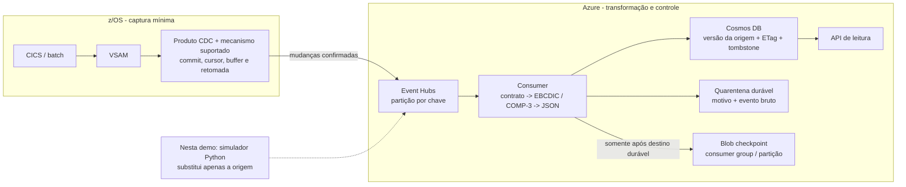

# VSAM -> Azure: controle de sincronismo near-real-time

Demo técnica, genérica e com dados sintéticos de **espelho de saldos para leitura**.
O mainframe continua sendo o sistema de registro. O objetivo é deslocar consultas
para Cosmos DB sem perder o controle sobre o que foi capturado, entregue e aplicado.

**Importante:** este repositório NÃO conecta a um mainframe nem implementa um produto
CDC de VSAM. Simula a saída de um adaptador de captura e implementa os controles
downstream. Um arquivo binário de registros exportados não é um dataset VSAM com
seus índices, catálogo e semântica de atualização.

## A pergunta central: quem percebe que o VSAM mudou?

**Um capturador compatível com a origem, não o parser no Azure.** VSAM não fornece
uma API CDC universal para todos os programas que escrevem nele.
Um produto de captura pode usar mecanismos de logging/instrumentação suportados.
Os requisitos dependem de CICS, batch, organização do dataset, recuperabilidade
e produto escolhido.

Para minimizar desenvolvimento COBOL, a primeira opção é **CDC de produto com
suporte comprovado aos writers reais do arquivo**. Ainda há instalação/configuração,
permissões, logs, capacidade e operação no z/OS. "Sem mudar a aplicação" não
significa "sem trabalho no mainframe" nem "sem consumo adicional de CPU".

Se não houver captura suportada para todos os writers, será necessário habilitar
um mecanismo compatível, integrar a aplicação ou usar extrações consistentes.
Polling de arquivos inteiros não equivale a CDC, pode perder mudanças intermediárias
e deletes e pode contrariar o objetivo de reduzir CPU.

### Recomendação para o CDC no mainframe

Avalie primeiro a ferramenta CDC já adotada pela organização. Para uma nova
avaliação, **Precisely Connect é um candidato**, apoiado pela
[arquitetura de referência Microsoft](https://learn.microsoft.com/en-us/azure/architecture/example-scenario/mainframe/mainframe-replication-precisely-connect).
Prefira captura baseada em logs quando suportada, sem desenvolver um leitor
artesanal nem fazer polling do arquivo inteiro. O produto deve cobrir **todos os
writers CICS e batch**, com commit/rollback, exclusões e retomada.

O caminho recomendado é inventariar datasets e writers, obter a configuração
suportada pelo fornecedor, preparar a captura no z/OS, coordenar snapshot com CDC
e publicar as mudanças no Event Hubs. Mantenha na origem apenas captura e
transporte; faça parsing, transformação e controles de aplicação no Azure.
Isso pode dispensar mudanças no COBOL, mas não configuração, operação ou CPU
adicional no mainframe. Veja o [roteiro de implementação e critérios da POC](docs/demo-guide.md#cdc-recomendado).

## Onde fica cada responsabilidade



| Componente | Faz | Não faz |
| --- | --- | --- |
| VSAM + aplicações | Persistem o estado autoritativo | Não publicam automaticamente um feed Azure |
| CDC/adaptador na origem | Identifica insert/update/delete confirmado, chave, ordem/cursor e retomada | Não precisa calcular o modelo de consulta |
| Event Hubs | Desacopla origem/destino, retenção, reentrega e ordem por partição | Não assegura ordem global, commit no Cosmos ou DLQ automática |
| Consumer no Azure | Valida contrato, decodifica copybook, trata versões, erros e checkpoint | Não descobre alterações nunca capturadas no z/OS |
| Cosmos DB | Guarda saldo e metadados de sincronismo com escrita condicional | `upsert` sozinho não impede regressão do saldo |
| Blob checkpoint | Registra até onde o consumer resolveu o transporte | Não é o cursor de captura nem comprovante de reconciliação |
| Quarentena | Preserva erros e gaps para diagnóstico e replay controlado | Avançar checkpoint não torna esses dados atualizados |
| Reconciliação | Compara chaves, versões e valores em um corte consistente | Não deve reler todo o VSAM a cada consulta |

## Execute a demonstração de controles

Há dois modos: **painel guiado no Azure**, com serviços reais e um botão por etapa,
e **ensaio local de falhas**, com SQLite. A seção abaixo descreve o ensaio local;
o painel e seu provisionamento estão na seção "Painel interativo no Azure".

Python 3.11+; comandos a partir da raiz do repositório:

```powershell
python -m venv .venv
.\.venv\Scripts\Activate.ps1
python -m pip install -r requirements.txt

# Use um diretório novo por execução: preserva a evidência anterior.
python -m vsam_offload.sync_demo --output .\out\sync-01 --interval-seconds 0.2
```

Alternativa: `.\scripts\run-local.ps1` escolhe uma pasta datada.
A demo gera eventos sintéticos com bytes EBCDIC/COMP-3, executa o consumidor local
e persiste artefatos, incluindo `events.jsonl` e `report.json`.
SQLite representa persistência local, **não emula a performance nem todas as
garantias do Cosmos DB**. O mesmo contrato alimenta o publisher Event Hubs.

O roteiro exercita atualização, duplicata, evento antigo, falha depois da gravação
e antes do checkpoint, retomada, gap, replay, registro inválido, delete e
reconciliação. Consulte o [guia técnico](docs/demo-guide.md) para explicar cada
passo, os resultados e o que permanece fora do escopo.

## Leia o código nesta ordem

| Código | Pergunta respondida |
| --- | --- |
| [copybook](samples/copybooks/ACCOUNT_BALANCE.cbl) | Como os 51 bytes representam uma conta? |
| [sync_contract.py](src/vsam_offload/sync_contract.py) | Que metadados o adaptador de captura deve entregar? |
| [eventhub_publisher.py](src/vsam_offload/eventhub_publisher.py) | Como todos os eventos de uma chave chegam à mesma partição? |
| [copybook.py](src/vsam_offload/copybook.py) | Como EBCDIC e COMP-3 viram campos sem alterar o COBOL? |
| [sync_engine.py](src/vsam_offload/sync_engine.py) | Quando aplicar, ignorar ou colocar em quarentena? |
| [sync_store.py](src/vsam_offload/sync_store.py) | Como persistir versão/estado e evitar sobrescrita concorrente? |
| [eventhub_consumer.py](src/vsam_offload/eventhub_consumer.py) | Em que ponto é seguro avançar o checkpoint? |
| [sync_demo.py](src/vsam_offload/sync_demo.py) | Como mostrar falha, retomada e reconciliação ao vivo? |

Exemplo: gerar uma mudança **sintética**, sem fazer parsing no publisher:

```python
from vsam_offload.generate_sample import SAMPLE_ROWS
from vsam_offload.sync_contract import make_event

row = dict(SAMPLE_ROWS[0], current_balance="12500.70")
event = make_event(row, version=2, previous_version=1)
# recordBase64 contém bytes do registro, não um documento Cosmos pronto.
# sourceVersion / previousVersion são contrato do adaptador, NÃO campos CDC nativos do VSAM.
```

## Painel interativo no Azure

Este repositório distribui o código e os templates, **não acesso a um ambiente
Azure existente**. Provisione sua própria instância seguindo as instruções abaixo.
O script informa o endereço após o deploy; não o inclua em commits ou issues.
Na sua instância, use "Nova execução" para começar sem reaproveitar o estado de
uma apresentação anterior.

O painel usa **Azure Container Apps** para hospedar a interface, a origem simulada
e o processamento Python. Os dados passam por **Blob Storage, Event Hubs e
Cosmos DB reais**. Não há Data Factory ou Azure Functions executando etapas
invisíveis: a tela identifica o serviço efetivamente usado em cada ação.

O card **Arquitetura Azure** apresenta o pipeline e a responsabilidade de cada
serviço, destacando a etapa selecionada. Mostra também o plano de controle
(manifestos, leases e checkpoints), a escrita condicional no Cosmos e o desenho
de rede e identidade do template. Os nomes dos recursos são carregados da
configuração autenticada, não estão fixados no código público. Selecionar um
componente do diagrama apenas abre sua etapa; não dispara o processamento.

| Botão | O que acontece | Evidência intermediária |
| --- | --- | --- |
| 1. Origem | Gera registros binários sintéticos cp037/COMP-3 | Arquivo bruto, hexadecimal, tamanho e copybook |
| 2. Transferir | Copia os bytes para a área de landing no Blob | SHA-256 da origem e do destino, sem conversão |
| 3. Parsing | Lê o arquivo de landing e aplica o copybook | Offsets, tipos, valores e JSON resultante |
| 4. Publicar | Envia envelopes ao Event Hubs | Identidades dos eventos e posições de transporte |
| 5. Aplicar | Recebe do Event Hubs e aplica o controle de versão no Cosmos | Resultado por evento e checkpoints persistidos |
| 6. Conferir | Relê os documentos do Cosmos e compara com a origem | Valores, versões e reconciliação |

Cada clique executa **somente uma etapa**. Os artefatos e o estado da execução
ficam no Storage para permitir inspeção e retomada. Após concluir, uma nova
alteração permite repetir o fluxo com uma versão mais recente da mesma conta.
As pausas do apresentador não representam latência de uma replicação automática.

O arquivo simulado contém bytes no layout COBOL demonstrado, **não índices nem
catálogo de um dataset VSAM nativo**. A captura z/OS continua fora do escopo.

### Provisionar e publicar o painel

Pré-requisitos: base `infra/main.bicep` já implantada, Azure CLI autenticada com
permissão de provisionamento e RBAC, Python e Bicep. O script usa ACR Tasks para
construir a imagem, sem precisar de Docker na máquina local.

```powershell
.\scripts\deploy-guided.ps1 -Subscription "<subscription-id>"
```

O template [infra/guided-app.bicep](infra/guided-app.bicep) acrescenta ambiente
Container Apps, VNet, Private Endpoints e DNS para Blob/Cosmos/Event Hubs,
identidade gerenciada, permissões de dados, ACR e Log Analytics. Acesso público
ao Storage e Cosmos permanece desabilitado. A interface exige um código de acesso
e estabelece uma sessão HTTPS; os serviços de dados usam identidade, não chaves.

O código é gerado no deploy e salvo **criptografado com Windows DPAPI** em
`out\guided-access.clixml`, excluído do Git e do contexto de build. Para consultá-lo
com a mesma conta Windows:

```powershell
.\scripts\show-demo-access.ps1
```

Não inclua esse código em apresentações, capturas de tela ou gravações. Essa
proteção é para uma demo não produtiva; não substitui uma solução corporativa de
autenticação, autorização por conta e auditoria.

Os novos recursos geram custo enquanto ativos: há uma réplica mínima de
apresentação, ACR, Private Endpoints, logs e throughput da coleção de quarentena.
O script não remove os recursos automaticamente.

### Cuidados ao publicar uma cópia

Mantenha fora do Git códigos de acesso, arquivos `.env`, credenciais, artefatos de
execuções e endereços de ambientes implantados. Os nomes nos templates são
exemplos genéricos; IDs de papéis RBAC e links de documentação são públicos.
Links para seus recursos no Azure Portal são construídos em tempo de execução
e só aparecem no painel após autenticação.

Todos os registros bancários incluídos são sintéticos. Não substitua a amostra
por dados reais de clientes em um repositório público.

### Evidências da implantação

Em 23/09/2026, o fluxo hospedado completou a carga de quatro registros
(204 bytes), uma alteração de um registro (51 bytes) e a leitura de conferência
no Cosmos. Os hashes de origem e landing coincidiram nas duas fases.
O roteiro também foi percorrido pelos seis botões da interface.
Isso demonstra a execução Azure desta amostra sintética; não mede a captura
z/OS, throughput de produção ou economia de CPU no mainframe.

## Caminho Azure por linha de comando

O template [infra/main.bicep](infra/main.bicep) provisiona recursos de dados,
consumer group, checkpoint e quarentena. Esse **template básico não implanta um
host de computação, Private Endpoints, DNS privado nem atribuições RBAC**; esses
componentes pertencem ao novo template `guided-app.bicep`. No modo CLI, o consumer
é executado explicitamente em um host autorizado, usando identidade Entra ID.

Storage e Cosmos permanecem com acesso público desabilitado; chaves compartilhadas
não são o caminho de autenticação desta revisão. Estar "em uma VNet" não basta:
é necessário ter Private Endpoint, DNS e conectividade efetivos.

```powershell
# Somente em subscription non-production aprovada. A criação gera custo.
az account set --subscription "<subscription-id>"
.\scripts\deploy.ps1 -ResourceGroup rg-mainframe-vsam-offload-demo -Location brazilsouth

# Terminal 1, em host com rede e permissões configuradas:
.\scripts\load-azure.ps1 -ResourceGroup rg-mainframe-vsam-offload-demo -Mode Consume

# Terminal 2:
.\scripts\load-azure.ps1 -ResourceGroup rg-mainframe-vsam-offload-demo -Mode Publish `
    -Events .\out\sync-01\events.jsonl
```

Enviar ao Event Hubs **não significa** ter sincronizado o Cosmos.
O sucesso ponta a ponta exige consumidor, gravação no destino, checkpoint e
reconciliação. A demo local não constitui evidência de captura em z/OS nem
medição de latência mainframe -> Azure.
Não execute o consumer contínuo sobre os eventos do painel durante uma
apresentação guiada: ele pode aplicar os dados antes do clique da etapa 5.

Os utilitários antigos `parse_vsam` e `cdc_simulator` continuam didáticos para
export/parse de arquivo; o segundo apenas divide um snapshot sintético.
`cosmos_loader` é um bootstrap legado create-only, não o caminho CDC.
Não misture documentos legados sem metadados com a coleção sincronizada.
O escopo executável é **saldo**; extrato e transações multi-entidade são discutidos
no guia, não implementados.

## Referências públicas

- [Microsoft: replicação mainframe com Precisely Connect](https://learn.microsoft.com/en-us/azure/architecture/example-scenario/mainframe/mainframe-replication-precisely-connect): arquitetura de referência com VSAM/Db2 e Event Hubs, não um case comprovando esta demo.
- [Microsoft: modernização de dados mainframe](https://learn.microsoft.com/en-us/azure/architecture/example-scenario/mainframe/modernize-mainframe-data-to-azure): fontes, formatos e destinos.
- [IBM Host File no Logic Apps](https://learn.microsoft.com/en-us/azure/connectors/integrate-host-files-ibm-mainframe): alternativa de parsing por metadados HIDX; parsing não é captura CDC.
- [ADF Binary](https://learn.microsoft.com/en-us/azure/data-factory/format-binary): copia bytes sem interpretar copybook.
- [ADF Db2](https://learn.microsoft.com/en-us/azure/data-factory/connector-db2): Copy/Lookup; não confundir com CDC log-based.
- [Event Hubs Python com checkpoint](https://learn.microsoft.com/en-us/azure/event-hubs/event-hubs-python-get-started-send): producer, consumer e checkpoints.
- [Concorrência otimista no Cosmos](https://learn.microsoft.com/en-us/azure/cosmos-db/database-transactions-optimistic-concurrency): ETag e limites de atomicidade.
- [IBM replication logging](https://www.ibm.com/docs/en/cics-ts/6.x?topic=processing-replication-logging): diferença entre logging e captura com fronteiras de commit/backout; configuração deve ser validada com o produto CDC.

O guia separa **viabilidade demonstrada no simulador**, **caminho Azure implementado**
e **validação obrigatória com captura real**. Não há promessa de economia de MIPS
ou garantia de atraso máximo na atualização dos dados a partir de quatro registros.
