# Padrão de offload VSAM para Azure com sincronismo near-real-time

Padrão de arquitetura para **espelhamento de dados de leitura do mainframe no Azure**,
com especificações de captura, controles de sincronismo e uma implementação de
referência que usa saldos sintéticos.
O mainframe continua sendo o sistema de registro. O objetivo é deslocar consultas
para Cosmos DB sem perder o controle sobre o que foi capturado, entregue e aplicado.

O material se destina a profissionais de arquitetura, desenvolvimento e operação
que precisam avaliar ou implementar esse padrão em seu próprio ambiente.
Não pressupõe uma relação comercial nem acesso a uma instalação existente.

## Como usar este padrão

| Objetivo | Seção ou artefato |
| --- | --- |
| Definir a captura sem instrumentar cada aplicação | [Opção de captura Mainframe por logs](#captura-mainframe-por-logs) |
| Revisar contratos, recuperação e critérios de aceite | [Especificação de engenharia](#especificacao-captura-mainframe) |
| Consultar a topologia e as responsabilidades | [Arquitetura](#onde-fica-cada-responsabilidade) |
| Avaliar componentes reutilizáveis | [Pesquisa open source](#cdc-vsam-open-source) |
| Executar o padrão com dados sintéticos | [Execução local](#execute-a-implementação-de-referência) e [painel no Azure](#painel-interativo-no-azure) |

**Importante:** este repositório NÃO conecta a um mainframe nem implementa um produto
CDC de VSAM. Simula a saída de um adaptador de captura e implementa os controles
downstream. Um arquivo binário de registros exportados não é um dataset VSAM com
seus índices, catálogo e semântica de atualização.

## A pergunta central: quem percebe que o VSAM mudou?

**Um capturador compatível com a origem, não o parser no Azure.** VSAM não fornece
uma API CDC universal para todos os programas que escrevem nele.
Um produto de captura pode usar mecanismos de logging/instrumentação suportados.
Os requisitos dependem de CICS, batch, organização do dataset, recuperabilidade
e produto escolhido.

Para minimizar desenvolvimento COBOL, a primeira opção é **CDC de produto com
suporte comprovado aos writers reais do arquivo**. Ainda há instalação/configuração,
permissões, logs, capacidade e operação no z/OS. "Sem mudar a aplicação" não
significa "sem trabalho no mainframe" nem "sem consumo adicional de CPU".

Se não houver captura suportada para todos os writers, será necessário habilitar
um mecanismo compatível, integrar a aplicação ou usar extrações consistentes.
Polling de arquivos inteiros não equivale a CDC, pode perder mudanças intermediárias
e deletes e pode contrariar o objetivo de reduzir CPU.

### Recomendação para o CDC no mainframe

Avalie primeiro a ferramenta CDC já adotada pela organização. Para uma nova
avaliação, **Precisely Connect é um candidato**, apoiado pela
[arquitetura de referência Microsoft](https://learn.microsoft.com/en-us/azure/architecture/example-scenario/mainframe/mainframe-replication-precisely-connect).
Prefira captura baseada em logs quando suportada, em vez de polling do arquivo
inteiro ou de um leitor de logs sem recuperação transacional. O produto deve cobrir **todos os
writers CICS e batch**, com commit/rollback, exclusões e retomada.

O caminho recomendado é inventariar datasets e writers, obter a configuração
suportada pelo fornecedor, preparar a captura no z/OS, coordenar snapshot com CDC
e publicar as mudanças no Event Hubs. Mantenha na origem apenas captura e
transporte; faça parsing, transformação e controles de aplicação no Azure.
Isso pode dispensar mudanças no COBOL, mas não configuração, operação ou CPU
adicional no mainframe. Veja a [estratégia de implementação e os critérios de homologação](docs/demo-guide.md#cdc-recomendado).

<a id="captura-mainframe-por-logs"></a>

### Opção de desenvolvimento: capturador independente por logs, online e batch

**Mecanismo sugerido para evitar instrumentar cada transação:** desenvolver um
serviço de captura separado das aplicações, consumindo os registros de alteração
produzidos pela infraestrutura CICS/VSAM. O objetivo é manter os fontes de negócio
sem gravações adicionais de outbox, desde que **todos os caminhos de escrita
tenham logging compatível e cobertura comprovada**.

Esta é uma **proposta de implementação, não um capturador incluído no repositório**.
O CICS oferece replication logging, não um motor CDC completo pronto para Azure.
Um produto suportado continua sendo a primeira opção; desenvolver o motor
transfere à equipe responsável a manutenção da recuperação, compatibilidade e operação.

| Caminho | Como produzir as mudanças | Condição de segurança |
| --- | --- | --- |
| Online via CICS | File Control com replication logging e recursos recuperáveis | Interpretar unidade de trabalho, commit e backout; forward recovery sozinho não basta |
| Batch que já atualiza por CICS | Capturar as operações efetivamente executadas dentro do CICS | Confirmar que não existem gravações diretas por fora desse caminho |
| Batch direto no VSAM | Adaptador para o logging suportado no ambiente, avaliando CICS VR e, para acesso transacional, DFSMStvs/RRS | Configuração, restrições, licenciamento e fronteira de confirmação próprios; não é capturado automaticamente pelo log CICS |
| Batch sem confirmação recuperável comprovada | Manter o lote pendente até um corte de negócio validado ou usar extração consistente coordenada | Não publicar cada gravação como se fosse uma transação confirmada; pode não atender à mesma latência do online |

**Batch faz parte do desenho, mas não existe um único parâmetro CICS que cubra
qualquer job.** RLS sozinho não oferece commit/backout; término de job não é uma
fronteira universal de commit. Mudar batch para DFSMStvs ou encaminhá-lo por um
serviço CICS pode exigir alterações e testes próprios. Se não houver logging
adequado, não se deve prometer captura completa sem mudar algum componente.

O capturador seria desenvolvido em módulos:

1. **Leitor de logstreams:** acesso autorizado ao z/OS System Logger, seleção de
   datasets e interpretação dos formatos de log da versão suportada. Interfaces
   como `IXGCONN`/`IXGBRWSE` e o layout FLJB/`DFHFCLGD` são referências técnicas,
   não uma API CDC remota nem o copybook de negócio.
2. **Montagem transacional e adaptador batch:** reunir imagens por UOW/UOR,
   liberar somente alterações cuja confirmação esteja estabelecida, tratar
   backout e reter transações em aberto. Não inventar commit para batch convencional.
3. **Normalização técnica:** gerar identidade estável do evento, chave, operação,
   cursor original, época da origem, identidade transacional, layout/CCSID e
   imagem bruta. Coordenar a ordem por entidade; timestamps não ordenam sozinhos
   mudanças de vários logstreams.
4. **Spool durável e controle de retomada:** persistir mudanças e estado pendente
   antes de avançar o cursor de leitura; manter confirmação de publicação separada.
   Pode usar armazenamento recuperável adequado ao ambiente, sem guardar o único
   checkpoint na memória do processo.
5. **Publicador desacoplado:** enviar envelopes ao Azure sem chamada de rede
   dentro da transação de saldo. Confirmar a entrega após o aceite durável do
   transporte; em falha ambígua, repetir a mesma identidade. O Azure controla a
   aplicação idempotente no Cosmos.

Para **saldo**, transportar a imagem absoluta e sua versão. Para **extrato**,
transportar os lançamentos com identidade própria, correções, estornos e exclusões.
Não gerar extrato pela diferença entre saldos. Se saldo e lançamento precisarem
ser visíveis juntos, preservar a fronteira transacional e projetar a aplicação
atômica no destino; isso não é garantido entre partições pelo Event Hubs/Cosmos.
O executável atual continua restrito a saldos sintéticos.

**Estratégia de implementação:** inventário de todos os writers → validação isolada de um
KSDS recuperável online → extensão ao batch e coordenação entre os dois caminhos
→ snapshot consistente associado a um corte de captura → operação em paralelo
com reconciliação → desvio gradual das consultas. O aceite deve exercitar commit,
rollback, abend/restart, publicação duplicada, represamento, retenção, deletes,
reload/reorganização e mudanças de layout, medindo CPU/I/O e atraso.

Essa abordagem busca **reduzir mudanças nos fontes e o alcance da regressão
funcional**, não eliminar configuração z/OS, testes de integridade/recuperação
ou risco operacional. Veja os [contratos, checkpoints e critérios de implantação](docs/demo-guide.md#captura-customizada).

<a id="especificacao-captura-mainframe"></a>

## Especificação de engenharia da captura Mainframe

Esta área deve ser tratada como **desenvolvimento de infraestrutura transacional**,
não como geração automática de um programa que faz `READ` e envia JSON.
Os artefatos de especificação, exemplos e prompts complementam a arquitetura
proposta. Eles **não certificam a captura em z/OS** e não alteram o escopo executável
da implementação de referência: saldos sintéticos processados no Azure.

### Pacote de especificação e rastreabilidade

| Artefato | Conteúdo | Estado atual |
| --- | --- | --- |
| [Especificação normativa](specs/mainframe-capture.json) | 32 requisitos `CAP-*`, contratos, máquinas de estados, falhas, NFRs e gates | `DRAFT_FOR_MAINFRAME_REVIEW`; captura não implementada |
| [Checklist de revisão](specs/mainframe-capture-review.txt) | Responsáveis, sequência de revisão e evidências exigidas | Revisão/assinatura do time Mainframe pendentes |
| [Validador da especificação](tests/test_capture_spec.py) | IDs, referências, estados e vínculos requisito/teste | Valida o documento; não executa COBOL nem APIs IBM |

A especificação contém **26 cenários de aceite `AT-*` e 20 decisões obrigatórias
`D001`–`D020` abertas**. Os aceites estão marcados `NOT_EXECUTED_ZOS`.
Os limites de desempenho e capacidade permanecem `null` até aprovação.
Não confundir um validador do JSON bem-sucedido com homologação do capturador.

### Exemplos de código e prompts prontos para revisão

| Arquivo | Padrão ilustrado |
| --- | --- |
| [CAPTURE-EVENT.cpy.example](samples/mainframe/CAPTURE-EVENT.cpy.example) | Buffer normalizado de projeto, separado dos formatos IBM e do copybook de negócio |
| [CAPTURE-STATE.cbl.example](samples/mainframe/CAPTURE-STATE.cbl.example) | Leitura, normalização e estado/cursor atômicos; commit e backout com partes atrasadas |
| [PUBLISH-ACK.cbl.example](samples/mainframe/PUBLISH-ACK.cbl.example) | Reserva com fencing, envio, resultado ambíguo e confirmação durável |
| [BATCH-GATE.cbl.example](samples/mainframe/BATCH-GATE.cbl.example) | Elegibilidade por modo batch; ausência de commit comprovado bloqueia publicação |
| [llm-prompts.txt](samples/mainframe/llm-prompts.txt) | Prompts para especificar, implementar por componente e revisar adversarialmente |
| [acceptance-cases.json](samples/mainframe/acceptance-cases.json) | Oito sequências de falha/replay vinculadas aos testes normativos |

As extensões `.example` são intencionais: são **fragmentos de desenho em sintaxe
COBOL, não programas compilados nem um capturador pronto**. Operações `PERFORM`
e interfaces de persistência precisam de implementação no ambiente aprovado.
As capacidades do buffer do exemplo são ilustrativas; não constituem limites
aprovados nem permitem truncamento silencioso. Nenhum copybook IBM proprietário
foi incorporado.

Exemplos de rastreabilidade:

| Requisito | Teste planejado | Evidência esperada |
| --- | --- | --- |
| `CAP-001`: cobertura de todos os writers | `AT-001` | Matriz writer/dataset/geração assinada; omissão bloqueia a entidade |
| `CAP-010`: estado/spool/cursor no mesmo commit | `AT-010`–`AT-012` | Traces de crash antes/durante/depois do commit e replay sem perda |
| `CAP-014`: reserva com fencing e ACK durável | `AT-013`, `AT-015` | Receipt do transporte, ACK persistido e rejeição de token obsoleto |
| `CAP-015`–`CAP-017`: cursores, retenção e lacunas | `AT-016`–`AT-019` | Prefixo contínuo, proteção da UOW longa e bloqueio de cursor expirado |
| `CAP-019`–`CAP-021`: saldo, lançamentos e visibilidade | `AT-021`, `AT-024`, `AT-026` | Oráculo independente, estornos/deletes e limites de atomicidade explícitos |
| `CAP-026`: recuperação batch | `AT-022` | Abend/restart por modo; nenhuma confirmação inferida apenas de `RC=0` |

Os formatos de evidência `A001`–`A012` são descritos no JSON: matriz de writers,
mapeamento de adapters, traces de origem/durabilidade/entrega, manifesto de
snapshot, reconciliação e revisão de gates. **São contratos de entregáveis
futuros, não arquivos de resultados fabricados.** Evidências reais devem ficar
em local autorizado; este repositório público recebe somente dados sintéticos.

### O que precisa ser fechado antes de gerar programas

| Decisão | Evidência que o time Mainframe deve fornecer |
| --- | --- |
| Plataforma e execução | Versões z/OS, CICS, compilador, linguagem do wrapper, LE/AMODE e contexto de execução do capturador |
| Fontes e escritores | Datasets, organização VSAM, regiões CICS, batch, utilitários, reloads e caminhos de acesso |
| Logging e recuperação | Atributos efetivos, logstreams, formatos documentados da versão instalada e cobertura de cada writer |
| Confirmação transacional | Como identificar UOW/UOR, commit, backout, rollback parcial, pendências e fronteira válida do batch |
| Persistência do capturador | Tecnologia que confirma atomicamente estado da captura, elegibilidade no spool e posição recuperável |
| Ordenação | Como estabelecer ordem por entidade entre escritores/streams; não assumir ordem global por timestamp |
| Identidade e layout | Chave da conta, identidade do lançamento, geração da origem, versão do copybook e CCSID |
| Operação | Retenção, capacidade, limite de atraso, RPO/RTO, alarmes, recuperação, segurança e responsáveis |

Sem essas informações, a saída correta da especificação ou de um LLM é
**“decisão pendente / geração bloqueada”**, não uma API, offset de log ou
garantia transacional inventada.

### Fronteiras de responsabilidade dos programas

O **adaptador de acesso ao System Logger** encapsula as interfaces documentadas
para a plataforma. O **núcleo COBOL de coordenação**, se COBOL for a escolha
aprovada, recebe eventos normalizados por esse adaptador; não precisa conhecer
todos os offsets internos de log. A linguagem e o vínculo do wrapper dependem
do ambiente. `IXGBRWSE` não deve aparecer como um `CALL` COBOL fictício.

O núcleo decide o que fica pendente, é descartado por backout ou pode ser
publicado. O armazenamento transacional guarda essas decisões. O publicador
trata envio, confirmação, retry e reservas. São componentes independentes da
transação de negócio existente: **não se introduz um novo `SYNCPOINT` nos
programas de saldo para implementar este padrão por logs**.

| Contrato | Entrada | Saída e obrigação |
| --- | --- | --- |
| Leitura | Posição recuperável, stream e geração autorizados | Registro bruto com identidade original; lacuna/expiração deve ser erro explícito |
| Normalização | Registro de log e formato aprovado | Imagem/chave/operação e semântica UOW/UOR; formato desconhecido bloqueia, não é ignorado |
| Aplicação no estado de captura | Evento normalizado e estado anterior | Estado pendente/confirmado, spool e posição recuperável consistentes após crash |
| Publicação | Evento elegível, identidade estável e reserva | Aceite durável do transporte ou retry; nenhuma exclusão antecipada |
| Confirmação | Identidade do evento e token de reserva | Atualização condicional de entrega, sem permitir ACK de worker obsoleto |

### Padrão 1: registrar estado antes de avançar a leitura

**Pseudocódigo COBOL de contrato — não compilável como está.** Os `PERFORM`
abaixo são operações de projeto a implementar; não são APIs IBM existentes.
A transação mencionada é do **estado do capturador**, não da aplicação de saldo.

```cobol
    PERFORM LER-PROXIMO-REGISTRO-LOG
    IF LEITURA-OK
        PERFORM VALIDAR-FORMATO-GERACAO-E-TAMANHOS
        IF REGISTRO-SUPORTADO
            *> Uma operação atômica, não três WRITEs independentes:
            *> 1. Registrar mudança/decisão UOW de forma idempotente
            *> 2. Ajustar elegibilidade no spool, se confirmado
            *> 3. Persistir posição que permita recuperação
            PERFORM APLICAR-ESTADO-E-CURSOR-ATOMICAMENTE
            IF NOT PERSISTENCIA-CONFIRMADA
                PERFORM PARAR-SEM-AVANCAR
            END-IF
        ELSE
            PERFORM BLOQUEAR-E-SINALIZAR-OPERACAO
        END-IF
    END-IF
```

Uma mudança de UOW aberta permanece pendente. Backout impede sua publicação.
Se o backout chegar antes de partes anteriores em outro stream, o estado fica
`BACKOUT_OBSERVED` até completar a captura; a chegada tardia comprovada não é
tratada como corrupção, e nenhuma dessas mudanças é publicada.
Um commit só libera alterações quando o leitor pode demonstrar cobertura e
interpretar a unidade de recuperação inteira. Transação longa pode exigir
spill em armazenamento durável; timeout não é commit.
Rollback parcial/savepoint exige semântica própria suportada pelo adaptador;
não se deve convertê-lo automaticamente em descarte ou confirmação da UOW inteira.

### Padrão 2: publicar antes de confirmar entrega

**Pseudocódigo COBOL de contrato.** A reserva é persistida com token e validade;
a chamada de rede ocorre sem manter lock de registro de negócio.

```cobol
    PERFORM RESERVAR-EVENTO-ELEGIVEL
    IF RESERVA-OBTIDA
        PERFORM PUBLICAR-COM-MESMO-EVENT-ID
        EVALUATE RESULTADO-PUBLICACAO
            WHEN ACEITE-DURAVEL
                PERFORM CONFIRMAR-ACK-COM-TOKEN-DA-RESERVA
            WHEN RESULTADO-AMBIGUO
                PERFORM MANTER-EVENTO-PARA-REENTREGA
            WHEN OTHER
                PERFORM REGISTRAR-FALHA-E-AGENDAR-RETRY
        END-EVALUATE
    END-IF
```

Se o transporte aceitou, mas o ACK local não foi persistido, a reentrega é
esperada. Não gerar novo `eventId` no retry. O destinatário protege o estado por
identidade/versão; isso é **at-least-once**, não exactly-once entre mainframe e Azure.
Um ACK com token de reserva vencido não pode avançar o controle.

### Padrão 3: batch sem commit comprovado não é publicado como confirmado

```text
Writer executou sob CICS recuperável?
  → Usar a fronteira UOW do CICS.
Writer usa modo transacional DFSMStvs/RRS validado?
  → Usar a fronteira UOR documentada para esse caminho.
Batch convencional, com imagens mas sem confirmação recuperável?
  → Manter pendente até uma fronteira de negócio/recuperação validada.
Writer ou formato desconhecido?
  → Bloquear cobertura/cutover e solicitar decisão da equipe responsável.
```

`RC=0`, fim de arquivo e horário de encerramento não substituem, isoladamente,
essa comprovação. Uma alternativa de janela consistente pode servir ao batch,
mas não deve herdar automaticamente a promessa de latência do online.

### Padrão 4: watermark contínuo e limpeza segura

```text
ACK por lote: 101=confirmado, 102=pendente, 103=confirmado
Watermark contínuo de publicação: 101, nunca simplesmente MAX(ACK)=103

Posição lida:         onde o leitor chegou
Posição recuperável: onde pode retomar sem perder estado/UOW em aberto
Confirmação de envio: o que o transporte aceitou duravelmente
Versão aplicada:      o que o Cosmos materializou por entidade
```

As posições pertencem ao stream e à geração corretos; um cursor opaco não é
comparável entre streams por ordem textual. A limpeza dos logs respeita a
posição mais antiga ainda necessária à recuperação e os demais leitores.
A limpeza do spool respeita a confirmação e a retenção aprovadas. Falta de
espaço ou expiração de logs exige intervenção/backpressure, nunca saltar para
“o último registro” silenciosamente.

### Prompts para implementação assistida por LLM

Use um pacote versionado de requisitos, documentação IBM da versão instalada,
layouts autorizados e fixtures sintéticas. Não forneça dados bancários reais,
credenciais ou documentos internos a serviços não autorizados.

Os prompts solicitam **decisões, hipóteses e justificativas técnicas resumidas
com evidências**. Não solicitam cadeia interna de pensamento. O critério de
qualidade é a rastreabilidade verificável, não a extensão do raciocínio narrado.

<details>
<summary>Prompt-base: fechar a especificação antes de gerar código</summary>

```text
Atue como engenheiro de sistemas z/OS/CICS e revisor de recuperação transacional.
Objetivo: capturar alterações de VSAM abaixo das aplicações, para saldo e
lançamentos, reduzindo mudanças nos programas de negócio quando houver cobertura.

Use specs/mainframe-capture.json e specs/mainframe-capture-review.txt como
base versionada. As decisões D001-D020 estão abertas; não as marque aprovadas
sem evidência fornecida por seus responsáveis.

Entradas obrigatórias:
- Versões z/OS/CICS/COBOL e ambiente de execução do capturador.
- Matriz de datasets, writers online/batch, modos de acesso e logging efetivo.
- Documentação dos formatos, interfaces, autorizações e códigos de retorno.
- Semântica de UOW/UOR, commit/backout e rollback parcial por caminho.
- Armazenamento transacional do estado/spool e suas garantias comprovadas.
- Contrato de eventos, ordenação, retenção, metas e critérios de aceite aprovados.

Não invente parâmetros, offsets, layouts IBM, APIs, status ou fronteiras de commit.
Se faltar entrada obrigatória, produza BLOCKED com perguntas objetivas e não
gere implementação que dependa dessas respostas.
Não altere programas de negócio nem configurações de produção.

Entregue:
1. Escopo, exclusões e matriz de cobertura por writer.
2. Requisitos numerados e decisões pendentes com responsável.
3. Contratos e estados, incluindo persistência atômica e retomada.
4. Justificativas técnicas curtas, alternativas e fontes versionadas.
5. Matriz requisito → teste → evidência esperada → responsável pelo aceite.
6. Riscos residuais e condições que bloqueiam cutover.

Marque cada afirmação como documentada, decidida pelo projeto ou pendente.
Não declare que houve compilação ou teste em z/OS sem anexar evidência real.
```

</details>

<details>
<summary>Prompt de implementação e revisão: um componente por vez</summary>

```text
Implemente apenas o componente [LEITOR / NORMALIZADOR / ESTADO / PUBLICADOR],
com base na especificação aprovada [VERSÃO], requisitos [CAP-IDs],
interface [I001 / I002 / I003 / I004] e decisões fechadas [D-IDs].

Antes do código, liste entradas ausentes e invariantes que o componente preserva.
Se uma dependência de plataforma não estiver definida, pare em BLOCKED.
Separe wrapper de API de sistema, núcleo COBOL e adaptador de persistência.
Interfaces de projeto ainda não implementadas devem estar claramente marcadas.

Exija:
- Validação de tamanho, tipo, geração, CCSID e limites sem truncamento silencioso.
- Estado de UOW persistente, rollback correto e nenhuma publicação prematura.
- Identidade estável no replay; nenhuma ordem global inferida de timestamps.
- Commit do estado/cursor recuperável ou protocolo WAL explicitamente aprovado.
- Reserva com fencing; envio fora de locks de negócio; ACK somente após aceite.
- Erro explícito em formato desconhecido, falta de autorização e lacuna de log.
- Telemetria sem payload bancário/credenciais e procedimento de recuperação.

Entregue fontes com copybooks de projeto, interfaces, tabela de erros,
instruções de build para o ambiente informado e testes sintéticos rastreados
aos AT-IDs. Gere os artefatos de evidência A-IDs aplicáveis sem inventar resultados.
Apresente justificativas técnicas resumidas e cite contratos/requisitos.
Não apresente pseudocódigo, stubs ou testes de formato como CDC homologado.

Um segundo revisor deve procurar perda/duplicação, avanço indevido de cursor,
publicação de rollback, reordenação entre writers, ACK obsoleto e limpeza precoce.
Classifique os achados por risco e condição de reprodução.
```

</details>

### O que caracteriza aceite técnico, e não apenas documentação

O time precisa obter evidências de compilação/link-edit, testes de integração
com o logging real e injeção de falhas na plataforma alvo. Em um corte de teste
controlado, exigir **zero alterações confirmadas perdidas, zero alterações
abortadas materializadas e zero regressões de versão**, além de reconciliação
de saldo e lançamentos. Metas de atraso, throughput, CPU/MSU, RPO/RTO e retenção
devem ser preenchidas pelo projeto, não presumidas pelo exemplo ou pelo LLM.

A aprovação deve envolver responsáveis por z/OS, CICS/recuperação, batch,
dados de saldo/extrato, segurança, operação e destino Azure.
O objetivo é tornar o trabalho estimável, testável e revisável — não declarar
essa camada pronta antes da homologação.

<a id="cdc-vsam-open-source"></a>

## Pesquisa de soluções open source para CDC VSAM

**Conclusão em 23/09/2026:** não foi verificada uma solução open source pronta que
cubra o conjunto **VSAM online CICS + batch direto + commit/backout + retomada
durável**, sem instrumentar os writers. Isso não prova que nenhum outro projeto
exista; a pesquisa é limitada às fontes públicas examinadas.

| Projeto | Licença observada | Função comprovada e limite para este caso |
| --- | --- | --- |
| [Cobrix](https://github.com/AbsaOSS/cobrix) | Apache-2.0 | Parsing de COBOL/EBCDIC e integração Spark; não resolve a captura transacional da origem |
| [JRecord](https://github.com/bmTas/JRecord) | LGPL-3.0 | Leitura/escrita de arquivos e copybooks; não é CDC de logs VSAM |
| [Kafka Connect MQ Source](https://github.com/ibm-messaging/kafka-connect-mq-source) | Apache-2.0 | Transporta mensagens existentes no MQ para Kafka; depende da captura anterior e de IBM MQ |
| [Debezium Db2](https://github.com/debezium/debezium-connector-db2) | Apache-2.0 | CDC de Db2, não VSAM; o README consultado ainda classifica Db2 z/OS como incubating |
| [Mainframe Ingress/Egress Patterns](https://github.com/chandu85/mainframe-data-ingress-egress-patterns) | Apache-2.0 | Padrões e implementações parciais; não foi comprovado motor CDC VSAM com as garantias exigidas |
| [cdc_setup](https://github.com/zeditor01/cdc_setup) | Não verificada | Receitas de implantação do IBM InfoSphere CDC; documentação pública não torna o motor open source |

Encontrar DSECTs, amostras de System Logger ou a palavra `LOGREPLICATE` em um
repositório não demonstra captura completa nem licença de redistribuição.
Não foram importados componentes desses projetos. As licenças e dependências
precisam de avaliação antes de qualquer incorporação.

A opção realista é usar open source **no parsing/transporte**, mantendo explícita
a lacuna de captura: qualificá-la com produto suportado ou desenvolver o motor
descrito nas specs. Não estender automaticamente garantias de conectores Kafka
ao Event Hubs. Fontes, escopo e limitações estão no
[registro da pesquisa](specs/opensource-vsam-evaluation.json).

## Onde fica cada responsabilidade

O bloco Mainframe abaixo detalha a **opção sugerida**, ainda não implementada.
Um motor de produto pode substituir o capturador próprio. A linha tracejada
indica integração futura; a implementação de referência usa a origem sintética separada.

```mermaid
flowchart LR
    subgraph Origem["Mainframe / z/OS - captura por logs SUGERIDA"]
        direction TB
        ONLINE["Programas online existentes"] --> FC["CICS File Control"]
        BATCH["Jobs batch existentes"] --> BV["Acesso batch ao VSAM"]
        FC --> VSAM["VSAM: saldos e lançamentos"]
        BV --> VSAM
        BATCH -. "Se já executa por CICS" .-> FC
        FC -. "Recursos recuperáveis" .-> CL["Replication logging CICS<br/>LOGREPLICATE; commit/backout"]
        BV -. "Cobertura a comprovar" .-> BL["Logging batch compatível<br/>CICS VR ou DFSMStvs/RRS, conforme cenário"]
        CL --> LOGS["z/OS System Logger<br/>logstreams da origem"]
        BL --> LOGS
        LOGS --> READ["Capturador independente<br/>leitor + adaptadores CICS/batch"]
        READ --> TX["Montagem UOW/UOR<br/>confirmação, backout e ordem por entidade"]
        TX --> SPOOL["Spool durável<br/>eventos, pendências e cursores"]
        SPOOL --> PUB["Publicador desacoplado<br/>retry com identidade estável"]
        PUB -. "Confirmação de publicação" .-> SPOOL
    end
    subgraph Azure["Azure - transformação e controle"]
        EH["Event Hubs<br/>partição por chave"]
        WORK["Consumer<br/>contrato -> EBCDIC / COMP-3 -> JSON"]
        COS["Cosmos DB<br/>versão da origem + ETag + tombstone"]
        Q["Quarentena durável<br/>motivo + evento bruto"]
        CP["Checkpoint externo<br/>consumer group/partição ou execução guiada"]
        API["API de leitura"]
        EH --> WORK
        WORK --> COS
        WORK --> Q
        WORK -->|"somente após destino durável"| CP
        COS --> API
    end
    PUB -. "Integração futura: mudanças confirmadas" .-> EH
    SIM["Fonte da implementação de referência: simulador Python"] --> LAND["Blob: origem e landing<br/>bytes preservados"]
    LAND --> PREVIEW["Parsing de inspeção no Azure<br/>publicação do envelope bruto"]
    PREVIEW --> EH
```



No batch sem fronteira de confirmação comprovada, o montador mantém a publicação
pendente. A simples existência de um registro de log não autoriza liberar a mudança.
O diagrama não promete ordem global entre logstreams nem atomicidade entre contas.

| Componente | Faz | Não faz |
| --- | --- | --- |
| VSAM + aplicações | Persistem o estado autoritativo | Não publicam automaticamente um feed Azure |
| Logging CICS/batch | Registra alterações nos caminhos configurados e suportados | Não cobre automaticamente todos os writers nem cria CDC completo |
| Motor de captura na origem | Interpreta confirmação/backout, identidade, ordem, spool e retomada | Não precisa calcular o modelo de consulta; permanece como componente proposto |
| Event Hubs | Desacopla origem/destino, retenção, reentrega e ordem por partição | Não assegura ordem global, commit no Cosmos ou DLQ automática |
| Consumer no Azure | Valida contrato, decodifica copybook, trata versões, erros e checkpoint | Não descobre alterações nunca capturadas no z/OS |
| Cosmos DB | Guarda saldo e metadados de sincronismo com escrita condicional | `upsert` sozinho não impede regressão do saldo |
| Blob checkpoint | Registra até onde o consumer resolveu o transporte | Não é o cursor de captura nem comprovante de reconciliação |
| Quarentena | Preserva erros e gaps para diagnóstico e replay controlado | Avançar checkpoint não torna esses dados atualizados |
| Reconciliação | Compara chaves, versões e valores em um corte consistente | Não deve reler todo o VSAM a cada consulta |

## Execute a implementação de referência

Há dois modos: **painel de execução no Azure**, com serviços reais e controle por etapa,
e **ensaio local de falhas**, com SQLite. A seção abaixo descreve o ensaio local;
o painel e seu provisionamento estão na seção "Painel interativo no Azure".

Python 3.11+; comandos a partir da raiz do repositório:

```powershell
python -m venv .venv
.\.venv\Scripts\Activate.ps1
python -m pip install -r requirements.txt

# Use um diretório novo por execução: preserva a evidência anterior.
python -m vsam_offload.sync_demo --output .\out\sync-01 --interval-seconds 0.2
```

Alternativa: `.\scripts\run-local.ps1` escolhe uma pasta datada.
A implementação gera eventos sintéticos com bytes EBCDIC/COMP-3, executa o consumidor local
e persiste artefatos, incluindo `events.jsonl` e `report.json`.
SQLite representa persistência local, **não emula a performance nem todas as
garantias do Cosmos DB**. O mesmo contrato alimenta o publisher Event Hubs.

O ensaio exercita atualização, duplicata, evento antigo, falha depois da gravação
e antes do checkpoint, retomada, gap, replay, registro inválido, delete e
reconciliação. Consulte o [guia de implementação](docs/demo-guide.md) para entender cada
passo, os resultados e o que permanece fora do escopo.

## Leia o código nesta ordem

| Código | Pergunta respondida |
| --- | --- |
| [copybook](samples/copybooks/ACCOUNT_BALANCE.cbl) | Como os 51 bytes representam uma conta? |
| [sync_contract.py](src/vsam_offload/sync_contract.py) | Que metadados o adaptador de captura deve entregar? |
| [eventhub_publisher.py](src/vsam_offload/eventhub_publisher.py) | Como todos os eventos de uma chave chegam à mesma partição? |
| [copybook.py](src/vsam_offload/copybook.py) | Como EBCDIC e COMP-3 viram campos sem alterar o COBOL? |
| [sync_engine.py](src/vsam_offload/sync_engine.py) | Quando aplicar, ignorar ou colocar em quarentena? |
| [sync_store.py](src/vsam_offload/sync_store.py) | Como persistir versão/estado e evitar sobrescrita concorrente? |
| [eventhub_consumer.py](src/vsam_offload/eventhub_consumer.py) | Em que ponto é seguro avançar o checkpoint? |
| [sync_demo.py](src/vsam_offload/sync_demo.py) | Como reproduzir falhas, retomada e reconciliação? |

Exemplo: gerar uma mudança **sintética**, sem fazer parsing no publisher:

```python
from vsam_offload.generate_sample import SAMPLE_ROWS
from vsam_offload.sync_contract import make_event

row = dict(SAMPLE_ROWS[0], current_balance="12500.70")
event = make_event(row, version=2, previous_version=1)
# recordBase64 contém bytes do registro, não um documento Cosmos pronto.
# sourceVersion / previousVersion são contrato do adaptador, NÃO campos CDC nativos do VSAM.
```

## Painel interativo no Azure

Este repositório distribui o código e os templates, **não acesso a um ambiente
Azure existente**. Provisione sua própria instância seguindo as instruções abaixo.
O script informa o endereço após o deploy; não o inclua em commits ou issues.
Na sua instância, use "Nova execução" para começar sem reaproveitar o estado de
uma execução anterior.

O painel usa **Azure Container Apps** para hospedar a interface, a origem simulada
e o processamento Python. Os dados passam por **Blob Storage, Event Hubs e
Cosmos DB reais**. Não há Data Factory ou Azure Functions executando etapas
invisíveis: a tela identifica o serviço efetivamente usado em cada ação.

O card **Arquitetura Azure** apresenta o pipeline e a responsabilidade de cada
serviço, destacando a etapa selecionada. Mostra também o plano de controle
(manifestos, leases e checkpoints), a escrita condicional no Cosmos e o desenho
de rede e identidade do template. Os nomes dos recursos são carregados da
configuração autenticada, não estão fixados no código público. Selecionar um
componente do diagrama apenas abre sua etapa; não dispara o processamento.
Dentro do card, o bloco **Mainframe · captura sugerida por logs** detalha a
alternativa online/batch e permanece marcado como proposta. Ele não substitui
a indicação da origem simulada nas etapas executáveis.

| Botão | O que acontece | Evidência intermediária |
| --- | --- | --- |
| 1. Origem | Gera registros binários sintéticos cp037/COMP-3 | Arquivo bruto, hexadecimal, tamanho e copybook |
| 2. Transferir | Copia os bytes para a área de landing no Blob | SHA-256 da origem e do destino, sem conversão |
| 3. Parsing | Lê o arquivo de landing e aplica o copybook | Offsets, tipos, valores e JSON resultante |
| 4. Publicar | Envia envelopes ao Event Hubs | Identidades dos eventos e posições de transporte |
| 5. Aplicar | Recebe do Event Hubs e aplica o controle de versão no Cosmos | Resultado por evento e checkpoints persistidos |
| 6. Conferir | Relê os documentos do Cosmos e compara com a origem | Valores, versões e reconciliação |

Cada clique executa **somente uma etapa**. Os artefatos e o estado da execução
ficam no Storage para permitir inspeção e retomada. Após concluir, uma nova
alteração permite repetir o fluxo com uma versão mais recente da mesma conta.
As pausas manuais não representam latência de uma replicação automática.

O arquivo simulado contém bytes no layout COBOL demonstrado, **não índices nem
catálogo de um dataset VSAM nativo**. A captura z/OS continua fora do escopo.

### Provisionar e publicar o painel

Pré-requisitos: base `infra/main.bicep` já implantada, Azure CLI autenticada com
permissão de provisionamento e RBAC, Python e Bicep. O script usa ACR Tasks para
construir a imagem, sem precisar de Docker na máquina local.

```powershell
.\scripts\deploy-guided.ps1 -Subscription "<subscription-id>"
```

O template [infra/guided-app.bicep](infra/guided-app.bicep) acrescenta ambiente
Container Apps, VNet, Private Endpoints e DNS para Blob/Cosmos/Event Hubs,
identidade gerenciada, permissões de dados, ACR e Log Analytics. Acesso público
ao Storage e Cosmos permanece desabilitado. A interface exige um código de acesso
e estabelece uma sessão HTTPS; os serviços de dados usam identidade, não chaves.

O código é gerado no deploy e salvo **criptografado com Windows DPAPI** em
`out\guided-access.clixml`, excluído do Git e do contexto de build. Para consultá-lo
com a mesma conta Windows:

```powershell
.\scripts\show-demo-access.ps1
```

Não exponha esse código em documentação pública, capturas de tela ou gravações.
Essa proteção é para uma instalação de referência não produtiva; não substitui uma solução corporativa de
autenticação, autorização por conta e auditoria.

Os novos recursos geram custo enquanto ativos: há uma réplica mínima do aplicativo,
ACR, Private Endpoints, logs e throughput da coleção de quarentena.
O script não remove os recursos automaticamente.

### Cuidados ao publicar uma cópia

Mantenha fora do Git códigos de acesso, arquivos `.env`, credenciais, artefatos de
execuções e endereços de ambientes implantados. Os nomes nos templates são
exemplos genéricos; IDs de papéis RBAC e links de documentação são públicos.
Links para seus recursos no Azure Portal são construídos em tempo de execução
e só aparecem no painel após autenticação.

Todos os registros bancários incluídos são sintéticos. Não substitua a amostra
por dados reais de pessoas ou organizações em um repositório público.

Os identificadores já usados pelo código, scripts e recursos foram preservados
por compatibilidade. O enquadramento do material é um padrão de implementação;
os nomes técnicos históricos não alteram seu escopo nem implicam uso em produção.

### Escopo exercitado da implementação de referência

Em 23/09/2026, o fluxo hospedado completou a carga de quatro registros
(204 bytes), uma alteração de um registro (51 bytes) e a leitura de conferência
no Cosmos. Os hashes de origem e landing coincidiram nas duas fases.
As seis etapas também foram executadas pela interface.
Isso demonstra a execução Azure desta amostra sintética; não mede a captura
z/OS, throughput de produção ou economia de CPU no mainframe.

## Caminho Azure por linha de comando

O template [infra/main.bicep](infra/main.bicep) provisiona recursos de dados,
consumer group, checkpoint e quarentena. Esse **template básico não implanta um
host de computação, Private Endpoints, DNS privado nem atribuições RBAC**; esses
componentes pertencem ao novo template `guided-app.bicep`. No modo CLI, o consumer
é executado explicitamente em um host autorizado, usando identidade Entra ID.

Storage e Cosmos permanecem com acesso público desabilitado; chaves compartilhadas
não são o caminho de autenticação desta revisão. Estar "em uma VNet" não basta:
é necessário ter Private Endpoint, DNS e conectividade efetivos.

```powershell
# Somente em subscription non-production aprovada. A criação gera custo.
az account set --subscription "<subscription-id>"
.\scripts\deploy.ps1 -ResourceGroup rg-mainframe-vsam-offload-demo -Location brazilsouth

# Terminal 1, em host com rede e permissões configuradas:
.\scripts\load-azure.ps1 -ResourceGroup rg-mainframe-vsam-offload-demo -Mode Consume

# Terminal 2:
.\scripts\load-azure.ps1 -ResourceGroup rg-mainframe-vsam-offload-demo -Mode Publish `
    -Events .\out\sync-01\events.jsonl
```

Enviar ao Event Hubs **não significa** ter sincronizado o Cosmos.
O sucesso ponta a ponta exige consumidor, gravação no destino, checkpoint e
reconciliação. A execução local não constitui evidência de captura em z/OS nem
medição de latência mainframe -> Azure.
Não execute o consumer contínuo sobre os eventos do painel durante uma execução
controlada por etapas: ele pode aplicar os dados antes do comando da etapa 5.

Os utilitários antigos `parse_vsam` e `cdc_simulator` continuam didáticos para
export/parse de arquivo; o segundo apenas divide um snapshot sintético.
`cosmos_loader` é um bootstrap legado create-only, não o caminho CDC.
Não misture documentos legados sem metadados com a coleção sincronizada.
O escopo executável é **saldo**; extrato e transações multi-entidade são discutidos
no guia, não implementados.

## Referências públicas

- [Microsoft: replicação mainframe com Precisely Connect](https://learn.microsoft.com/en-us/azure/architecture/example-scenario/mainframe/mainframe-replication-precisely-connect): arquitetura de referência com VSAM/Db2 e Event Hubs, não evidência de homologação desta implementação.
- [Microsoft: modernização de dados mainframe](https://learn.microsoft.com/en-us/azure/architecture/example-scenario/mainframe/modernize-mainframe-data-to-azure): fontes, formatos e destinos.
- [IBM Host File no Logic Apps](https://learn.microsoft.com/en-us/azure/connectors/integrate-host-files-ibm-mainframe): alternativa de parsing por metadados HIDX; parsing não é captura CDC.
- [ADF Binary](https://learn.microsoft.com/en-us/azure/data-factory/format-binary): copia bytes sem interpretar copybook.
- [ADF Db2](https://learn.microsoft.com/en-us/azure/data-factory/connector-db2): Copy/Lookup; não confundir com CDC log-based.
- [Event Hubs Python com checkpoint](https://learn.microsoft.com/en-us/azure/event-hubs/event-hubs-python-get-started-send): producer, consumer e checkpoints.
- [Concorrência otimista no Cosmos](https://learn.microsoft.com/en-us/azure/cosmos-db/database-transactions-optimistic-concurrency): ETag e limites de atomicidade.
- [IBM replication logging](https://www.ibm.com/docs/en/cics-ts/6.x?topic=processing-replication-logging): diferença entre logging e captura com fronteiras de commit/backout; configuração deve ser validada com o produto CDC.

O guia separa **comportamento exercitado com dados sintéticos**, **caminho Azure implementado**
e **validação obrigatória com captura real**. Não há promessa de economia de MIPS
ou garantia de atraso máximo na atualização dos dados a partir de quatro registros.
