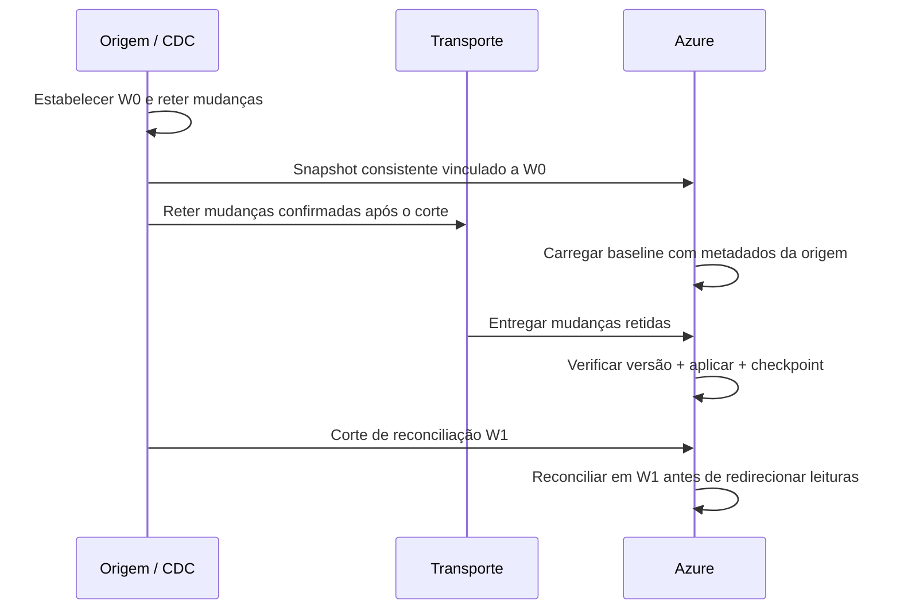
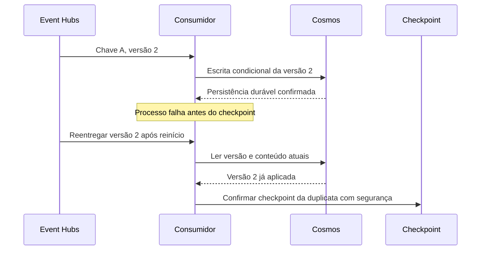

# Guia de implementação: captura e sincronismo VSAM para Azure

## 1. Comece pela fronteira de responsabilidade

A pergunta não é apenas "como decodificar os bytes?", mas:
**como identificar todas as alterações confirmadas, sem depender de consultar
o mainframe toda vez que alguém pede um saldo?**

Na arquitetura proposta, o mainframe conserva as transações e o VSAM. Uma camada
de captura identifica as mudanças e as transporta. O Azure aplica o modelo de
leitura e controla processamento, recuperação e qualidade.

| Passo | Responsável | Entrada -> saída | Evidência a mostrar |
| --- | --- | --- | --- |
| 1. Capturar | Produto/agente CDC compatível com z/OS | Mudanças confirmadas -> registro + chave + operação + cursor | Na homologação: log/cursor do produto e transação de origem |
| 2. Transportar | Adaptador de captura + Event Hubs | Evento durável -> partição ordenada por chave | Mesmo `accountId` como partition key |
| 3. Validar | Consumer Azure | Envelope -> contrato aceito ou quarentena | Schema, época, chave, timestamp e formato verificados |
| 4. Decodificar | Parser Azure | Registro EBCDIC/COMP-3 + copybook -> campos | Registro binário de 51 bytes e JSON |
| 5. Aplicar | Engine + Cosmos | Estado atual + versão recebida -> decisão | Applied / duplicate / stale / quarantine |
| 6. Confirmar | Consumer + Blob checkpoint | Resultado durável -> posição de transporte | Checkpoint não antecede a gravação |
| 7. Recuperar | Operação Azure + retenção da origem | Falha/gap -> retomada ou replay autorizado | Crash depois da escrita e reentrega segura |
| 8. Reconciliar | Origem + processo Azure | Dois estados no mesmo corte -> diferenças | Chaves, versões, valores e hash canônico |
| 9. Servir | API + Cosmos | Consulta de saldo -> espelho | Atraso na atualização e indisponibilidade precisam de política definida |

**Não é necessário mover a transformação para o mainframe.** O adaptador pode
entregar bytes brutos e metadados; o copybook funciona como contrato do parser
no Azure. Se o produto já entrega campos decodificados, o parser customizado
pode ser dispensado. O conector real precisa de um adaptador para o contrato
desta implementação de referência: nenhum formato de saída de fornecedor é presumido.

## 2. Precisa desenvolver do lado do mainframe?

| Situação | Trabalho na origem | Desenvolvimento da aplicação |
| --- | --- | --- |
| CDC de produto suporta o dataset e todos os writers | Instalar/configurar agente, logs, RACF, retenção, filtros, conexões e operação | Pode ser desnecessário; confirmar com fornecedor e equipe z/OS |
| Escritas CICS com logging compatível | Configurar captura, recuperabilidade/log apropriado e coordenação transacional | Não presumir que basta habilitar um parâmetro para qualquer produto |
| CICS e batch escrevem no mesmo VSAM | Cobrir os dois caminhos; avaliar componente de captura batch, restrições e janelas | Depende do mecanismo suportado; CICS sozinho não cobre automaticamente o batch |
| Não existe captura suportada | Habilitar journaling/instrumentação, integrar aplicação ou exportar snapshots consistentes | Pode exigir alteração COBOL/JCL/integração e testes transacionais |
| Apenas unload periódico disponível | Gerar cópia consistente e transferir bytes + manifesto | Menor sofisticação, mas não prova CDC transacional near-real-time |

<a id="cdc-recomendado"></a>

### Recomendação prática: como implementar o CDC na origem

**Priorize um produto CDC suportado, com captura baseada em logs quando houver
suporte ao ambiente e aos caminhos de escrita.** Avalie primeiro o CDC já adotado
pela empresa ou o Precisely Connect, citado na
[arquitetura de referência da Microsoft](https://learn.microsoft.com/en-us/azure/architecture/example-scenario/mainframe/mainframe-replication-precisely-connect).
Essa referência orienta a avaliação, mas não comprova compatibilidade com qualquer
VSAM: o produto precisa cobrir **todos os writers** (processos que escrevem nos
datasets), não apenas anunciar "suporte a VSAM".

| Etapa | Ação prática | Evidência necessária |
| --- | --- | --- |
| 1. Inventariar a origem | Mapear datasets KSDS/ESDS/RRDS, chaves e copybooks; listar todas as regiões CICS, rotinas batch, utilitários e recargas (reloads) que escrevem neles | Inventário dos caminhos de escrita, inclusive cargas e reorganizações |
| 2. Validar o suporte | Obter do fornecedor a configuração de captura suportada para as versões específicas do produto, do z/OS e dos componentes envolvidos | Cobertura documentada de insert/update/delete, commit/rollback e restart para cada caminho de escrita |
| 3. Preparar a operação | Instalar/configurar o agente e os componentes do produto com a equipe z/OS; dimensionar logging, permissões RACF, retenção, capacidade e rede | Procedimento aprovado de instalação, recuperação e monitoramento; não alterar a configuração de recovery às cegas |
| 4. Coordenar a carga inicial | Obter um snapshot consistente vinculado a um cursor de captura e reter as mudanças enquanto a baseline é carregada | Corte inicial rastreável e continuidade entre snapshot e CDC, sem janela de perda |
| 5. Transportar o envelope | Preservar chave, operação, cursor da origem, `eventId` estável e ordem; incluir bytes brutos se o produto os oferecer e adaptar seu contrato de saída ao da implementação de referência; publicar no Event Hubs por um publisher distribuído, quando aplicável | Contrato validado do fornecedor, cursor preservado e identidade/ordem mantidas na retomada e na reentrega |

Na origem, mantenha apenas **captura e transporte**; deixe parsing, transformação,
deduplicação, quarentena, replay, reconciliação e APIs no Azure. O pacote CDC pode
ter componentes no z/OS e componentes distribuídos: isso **não exige que o COBOL
publique mensagens**. Com cobertura suportada, desenvolver código na aplicação
pode ser desnecessário, mas continuam existindo configuração, administração,
trabalho operacional e consumo de CPU.

CICS e batch devem ser validados separadamente. Habilitar `LOG(ALL)` não cria um
CDC universal; os mecanismos e as referências IBM abaixo ajudam a identificar as
distinções, não substituem as instruções do fornecedor. Não trate um leitor de
logs sem recuperação como CDC, nem use polling como substituto de captura
transacional. A opção de desenvolvimento abaixo exige um motor de captura
completo, com escopo de formatos e caminhos explicitamente suportados.
Também evite dual-write ingênuo: gravar VSAM e depois enviar uma mensagem pode
deixar os dois lados divergentes se ocorrer falha entre as operações.

Comece a validação com **um VSAM de saldos representativo e todos os seus writers**.
O aceite deve comprovar captura de alterações confirmadas, rollback sem estado
definitivo indevido, delete, escrita batch, interrupção e retomada sem perda,
além de reconciliação no mesmo corte. Meça CPU/MSU antes e depois, incluindo o
custo da captura; não há garantia prévia de economia. A implementação de referência
não inclui CDC nativo de VSAM: essa integração precisa ser homologada.

z/OS Connect expõe serviços; não deve ser desenhado como um capturador universal
de alterações VSAM. ADF copia dados/arquivos, não cria o histórico de mudanças
que não existe na origem. SMF genérico não equivale a um feed completo de
imagens de registros confirmados.

### O detalhe de logging que evita uma promessa errada

A documentação IBM diferencia **forward recovery** de **replication logging**.
Uma after-image isolada no log não comprova que a transação fez commit.

| Mecanismo IBM | Documentação | Implicação para a captura |
| --- | --- | --- |
| VSAM em RLS | `LOG(NONE)`, `LOG(UNDO)`, `LOG(ALL)` e `LOGSTREAMID` no catálogo ICF | Nem todo arquivo tem logging útil; a configuração FILE de recovery não governa RLS |
| Non-RLS | `RECOVERY(ALL)` e `FWDRECOVLOG` para forward recovery | Existem mecanismos distintos de before/after-images e journaling |
| Replication logging CICS | Tabela IBM de `LOGREPLICATE` e recuperabilidade | Para arquivos recuperáveis, inclui informações de COMMIT/BACKOUT; não presumir isso de todo forward log |
| CICS VR batch logging | `FRLOG` e configuração do logstream | Batch precisa de cobertura própria; há restrições e requisitos de ativação |

Referências:
[RLS](https://www.ibm.com/docs/en/cics-ts/6.x?topic=resources-vsam-files-accessed-in-rls-mode),
[non-RLS](https://www.ibm.com/docs/en/cics-ts/6.x?topic=resources-vsam-files-accessed-in-non-rls-mode),
[replication logging](https://www.ibm.com/docs/en/cics-ts/6.x?topic=processing-replication-logging),
[SYNCPOINT](https://www.ibm.com/docs/en/cics-ts/6.x?topic=summary-syncpoint) e
[CICS VR batch](https://www.ibm.com/docs/en/cvrfz/6.3.0?topic=logging-enabling-cics-vr-vsam-batch).

Essas são capacidades IBM, **não uma receita de instalação do Precisely**.
Não executar alterações de logging somente a partir deste guia.
A arquitetura Microsoft descreve captura/publisher e tratamento de commit/rollback,
mas não substitui a matriz de suporte da versão do fornecedor. A documentação
técnica Precisely consultada não permitiu confirmar requisitos completos de
batch nem um formato bruto Event Hubs pronto para este contrato. Confirmar ambos
com o fornecedor antes de vender a solução como plug-and-play.

### Perguntas de discovery que decidem o desenho

1. Quais datasets (KSDS/ESDS/RRDS) contêm saldo e extrato? Quais chaves e copybooks?
2. Quem escreve: regiões CICS, jobs batch, ferramentas, cargas/reorganizações?
3. Qual é a configuração atual de recuperabilidade/logging? Que produtos de CDC já estão licenciados?
4. O mecanismo cobre insert/update/delete, rollback, batch e restart com o mesmo contrato?
5. Como identifica commit, ordem, posição de retomada e mudança de geração da origem?
6. Quais são a janela de logs, a taxa de mudanças, o tamanho médio e a tolerância a backpressure?
7. Qual é o limite de atraso aceitável na atualização dos dados por operação? Que consultas podem usar estado defasado?
8. Como produzir uma baseline consistente sem interromper a operação?
9. Qual é o consumo atual de CPU/MSU por consulta e quanto custa capturar e reconciliar?

<a id="captura-customizada"></a>

### Opção: desenvolver captura abaixo das aplicações

**Objetivo:** reduzir a necessidade de modificar cada programa que atualiza saldo
ou extrato, usando logging na infraestrutura e um capturador independente.
Essa opção não é uma outbox gravada pela aplicação. Também não é um CDC universal
embutido no VSAM: é um projeto de infraestrutura z/OS a ser implementado e operado.
O [bloco Mainframe do README](../README.md#captura-mainframe-por-logs) mostra os
componentes propostos; a implementação Azure continua consumindo uma origem simulada.
O contrato normativo está em [specs/mainframe-capture.json](../specs/mainframe-capture.json);
o [checklist de revisão](../specs/mainframe-capture-review.txt) explica os gates,
os responsáveis e a ligação entre requisitos, aceites e evidências.

#### Cobertura online e batch antes de desenvolver

| Origem das gravações | Mecanismo a avaliar | Fronteira que autoriza publicar |
| --- | --- | --- |
| CICS com arquivos recuperáveis | Replication logging, atributos de recovery e LOGSTREAMID compatíveis | Commit da UOW; backout descarta a alteração, pendência não é sucesso |
| Batch cuja escrita já ocorre por serviço CICS | O mesmo caminho CICS para as operações efetivamente executadas nele | A UOW do serviço; verificar gravações externas e tamanho das unidades |
| Batch direto com acesso transacional | DFSMStvs/RRS e logging de replicação compatível com a versão/configuração | Unidade de recuperação coordenada; RLS sozinho não fornece commit/backout |
| Batch direto convencional | CICS VR/logging batch quando disponível e suportado | Regra de conclusão e recuperação comprovada para aquele workload; não supor commit por registro |
| Writer ou utilitário sem logging compatível | Resolver a cobertura ou coordenar extração/rebaseline | Bloquear cutover desse fluxo; não declarar captura completa |

As opções CICS VR e DFSMStvs/RRS **não são intercambiáveis nem dependências
automaticamente disponíveis**. Conferir licenciamento, habilitação, RLS/non-RLS,
organização do dataset, linguagem/runtime e limitações. A ativação de logging
não transforma um batch convencional em aplicação transacional.

Se a confirmação de negócio só puder ser estabelecida ao fim de uma janela,
a publicação segura desse batch poderá ter latência maior que a do online.
Uma política que publique imagens intermediárias é outro contrato, que exige
aceite explícito e não deve ser apresentado como espelho de dados confirmados.
Encaminhar batch por CICS é alternativa, mas pode exigir mudanças de integração:
não faz parte da promessa de "nenhuma alteração".

#### Componentes a desenvolver no Mainframe

| Módulo | Responsabilidade | Estado durável |
| --- | --- | --- |
| Leitores/adaptadores | Consumir logstreams autorizados e interpretar os formatos CICS e batch escolhidos | Identidade/geração do stream e posição de leitura recuperável |
| Montador UOW/UOR | Associar imagens à unidade de trabalho, interpretar commit/backout, conservar pendências | Mudanças ainda não confirmadas e fronteiras já resolvidas |
| Normalizador técnico | Identificar dataset, chave, operação, transação, layout/CCSID e imagem do registro | Identidade estável e ordenação por entidade conforme contrato |
| Spool de saída | Reter alterações liberadas para publicação, sem perder dados em indisponibilidade Azure | Conteúdo imutável, estado de entrega e referência à origem |
| Publicador | Enviar envelopes ou micro-lotes; repetir com a mesma identidade após resultado ambíguo | Confirmação durável de publicação por evento/lote e stream |
| Supervisor | Detectar atraso, pendências antigas, falta de espaço, logs indisponíveis e mudanças de geração | Alarmes, estado de recuperação e bloqueios para operação |

Uma implementação pode usar uma started task ou serviço equivalente no z/OS,
com módulos na linguagem apropriada às interfaces suportadas. As macros de
System Logger, como `IXGCONN`/`IXGBRWSE`, exigem integração de programação de
sistemas e autorização de leitura. Não são chamadas diretas ao Azure nem uma
biblioteca COBOL de CDC pronta.

A IBM documenta o FLJB e o DSECT `DFHFCLGD` para registros de File Control.
**Esse layout não é o copybook de saldo:** primeiro se interpreta o registro de
log e sua semântica transacional; depois se extrai a imagem bruta de negócio.
O parser Azure recebe essa imagem, não deve interpretar o log CICS inteiro.
Formatos suportados, tie-ups, registros de fechamento e evolução de versão
devem fazer parte do contrato e dos testes do leitor.

O armazenamento do spool/estado pode ser MQ persistente, datasets recuperáveis
ou outro mecanismo durável aprovado pela equipe z/OS. A escolha não dispensa
coordenação entre dados e checkpoints. Não inventar um protocolo de commit
entre dois arquivos não recuperáveis.

#### Algoritmo conceitual de leitura e publicação

```text
abrir logstream a partir da posição recuperável
para cada registro:
    identificar stream/geração, tipo de registro e unidade de recuperação
    persistir a mudança ou a decisão de commit/backout no estado de captura
    se a unidade estiver confirmada:
        tornar suas mudanças elegíveis no spool de saída
    se houver backout:
        bloquear publicação e persistir BACKOUT_OBSERVED
        absorver partes anteriores ainda ausentes, sem efeitos de negócio
        concluir DISCARDED somente após comprovar completude da captura
    se a confirmação não puder ser interpretada:
        reter pendência e sinalizar; não presumir commit
    avançar a posição de leitura somente com recuperação demonstrável

publicador independente:
    reservar mudança elegível respeitando a ordem por entidade
    publicar e aguardar confirmação durável do transporte
    persistir confirmação de publicação
    em resultado ambíguo, repetir com o mesmo eventId
```

O algoritmo é **pseudocódigo de desenho, não uma implementação incluída no repo**.
Uma falha entre persistência e checkpoint precisa ser recuperável por replay
idempotente. Não manter locks de registros de negócio durante chamadas de rede.
Também não usar exits ou hooks de baixo nível como atalho para ignorar commit:
interceptar um WRITE concluído não prova confirmação da transação.

#### Watermarks e represamento

O capturador mantém pelo menos dois controles separados, **por logstream/geração**:

| Controle | Quando avança | O que não significa |
| --- | --- | --- |
| Posição de leitura recuperável | Depois de persistir estado suficiente para recuperar inclusive UOWs abertas, ou preservando o log necessário para relê-las | Não significa publicação nem aplicação no Cosmos |
| Confirmação de publicação | Depois do aceite durável do transporte e da persistência local desse aceite | Não significa que todos os consumers aplicaram a mudança |
| Checkpoint do consumer Azure | Depois de escrita/aplicação resolvida duravelmente, conforme a política de erro | Não substitui os controles da origem |
| Corte de reconciliação | Depois de comparar os estados no mesmo corte definido | Não pode ser inferido apenas do maior offset |

O menor cursor ainda necessário por uma transação aberta/replay limita a limpeza
dos logs. O spool só pode ser limpo conforme a política de entrega e recuperação,
não porque o leitor já avançou. Se lotes 101 e 103 foram publicados, mas 102 não,
registrar os resultados individuais e manter o watermark contínuo antes da lacuna.
**Confirmar e apagar antes do envio durável causaria perda.**

Uma indisponibilidade Azure represa o spool; o leitor só pode continuar enquanto
há capacidade e retenção seguras. Dimensionar taxa de mudanças × tamanho dos
eventos × janela de recuperação, monitorar capacidade e definir backpressure.
Se a retenção expirar, sinalizar lacuna e executar recuperação/rebaseline;
nenhum checkpoint recria dados descartados.

#### Contrato de saldo e extrato

Saldo é uma imagem absoluta por conta, com ordenação que impeça regressão.
Extrato requer **lançamentos identificáveis**, inclusive correções, estornos,
exclusões e ordem de negócio. Diferenças entre saldos não reconstituem o extrato.

O envelope de produção deve incluir origem/geração, dataset e chave, operação,
posição original, identidade estável do evento, transação/UOR, layout/CCSID e
imagem bruta pertinente. A ordem precisa ser derivada de semântica comprovada
da origem. Dois logstreams não possuem automaticamente um contador global;
concatenar seus timestamps não resolve escritores concorrentes.

Os campos `sourceVersion` e `previousVersion` do exemplo são um contrato sintético.
Um adaptador real deve fornecer uma ordem por entidade estável e recuperável
ou adaptar os controles downstream explicitamente. **Não é necessário adicionar
o campo `SEQUENCE-NUMBER` do exemplo aos copybooks de negócio** apenas para
aproveitar o padrão arquitetural. O exemplo não é um adaptador pronto para os logs
reais, e o seu parser de 51 bytes não representa todo saldo/extrato de produção.

Se uma mesma transação alterar saldo e lançamento, preservar essa relação.
Visibilidade atômica no Cosmos só é possível dentro dos limites do modelo
transacional escolhido; várias contas/partições podem exigir outra estratégia
de materialização. O caminho executável atual não implementa extrato nem
transação distribuída CICS + Event Hubs + Cosmos.

#### Estratégia de implementação e critérios de passagem

1. **Discovery e contrato:** inventariar datasets/writers, recovery/logging,
   SLAs de atraso, semântica batch e licenças. Não avançar sem plano para cada writer.
2. **Validação online restrita:** um KSDS recuperável; leitor autorizado, montagem UOW,
   spool e replay. Exercitar insert/update/delete, rollback, abend e restart.
3. **Cobertura batch:** adicionar o adaptador para o modo efetivamente usado;
   testar erro/restart do job e confirmar que não são publicados estados indevidos.
   Validar ordem e integridade com acessos online/batch coordenados.
4. **Carga inicial:** obter snapshot consistente associado a um corte W0,
   retendo mudanças necessárias. Na primeira prova, uma pausa coordenada de
   writers pode simplificar o corte; snapshot concorrente exige protocolo específico.
5. **Operação paralela:** sem desviar consultas, comparar saldo e lançamentos em
   cortes consistentes; medir CPU/MSU, I/O, atraso, backlog e retenção. Simular
   indisponibilidade do Azure, replay e falha após envio antes da confirmação local.
6. **Cutover gradual:** liberar somente consultas elegíveis, com política para
   dados atrasados e retorno controlado ao sistema de registro. Ensaiar
   reorganização, reload/restauração, troca de geração e evolução de copybook.

Não é necessário testar alterações de fonte em cada programa quando não houve
alteração de fonte, mas continua necessário testar **todos os caminhos de
escrita cobertos**, concorrência, recuperação e impacto na plataforma.
A mudança centralizada pode afetar muitas aplicações; isso não é ausência de risco.

#### Referências primárias para essa opção

- [CICS replication logging](https://www.ibm.com/docs/en/cics-ts/6.x?topic=processing-replication-logging): logging produzido pelo CICS e consumido por mecanismo externo.
- [FLJB / DFHFCLGD](https://www.ibm.com/docs/api/v1/content/SSJL4D_6.x/system-programming/cics/dfha31m.html?lang=en): formato de File Control, incluindo commit/backout para replicação.
- [Autorização de aplicações System Logger](https://www.ibm.com/docs/en/zos/2.3.0?topic=stream-requesting-authorization-log-application): acesso ao logstream; conferir documentação correspondente à versão instalada.
- [CICS VR batch logging](https://www.ibm.com/docs/en/cvrfz/6.3.0?topic=logging-enabling-cics-vr-vsam-batch): opções e restrições próprias de batch.
- [DFSMStvs](https://www.ibm.com/docs/en/zos/3.1.0?topic=environment-dfsmstvs-overview): recuperação transacional acrescentada ao VSAM RLS.
- [UORs em replicação VSAM](https://www.ibm.com/docs/api/v1/content/SSTRGZ_11.4.0/com.ibm.cdcdoc.classiccdcforzos.doc/concepts/vsamcdcuors.html?lang=en): diferença entre fontes recuperáveis e agrupamentos não recuperáveis.

Essas referências sustentam os blocos e as restrições do desenho; não constituem
uma certificação IBM de um motor customizado. O desenvolvimento e sua manutenção
precisam de responsáveis especializados em z/OS/CICS e recuperação.

## 3. Quatro posições diferentes, nunca uma única "sequence"

| Controle | Escopo | Quem persiste | Por que existe |
| --- | --- | --- | --- |
| Cursor de captura | Fluxo/log da origem | Produto CDC | Retomar sem perder mudanças após queda de rede/agente |
| Checkpoint de transporte | Event hub + consumer group + partição | BlobCheckpointStore | Reentregar o que o consumer ainda não confirmou |
| Versão aplicada | Chave da entidade + época da origem | Documento Cosmos | Evitar regressão, detectar duplicata/conflito/gap |
| Watermark de reconciliação | Corte consistente de origem e destino | Processo de reconciliação | Demonstrar completude, não somente atividade do pipeline |

O offset do Event Hubs **não é a versão do VSAM**. Ele muda ao republicar um evento.
O `eventId` deve permanecer estável no retry. O timestamp de chegada também não
define a ordem de atualização.

O exemplo usa `sourceVersion` e `previousVersion` numéricos por chave dentro de
`sourceEpoch`. Estes são **metadados sintéticos do adaptador**, não funcionalidade
nativa do VSAM nem uma exigência de acrescentar colunas ao copybook real.
Versões não precisam ser consecutivas: o predecessor declarado precisa coincidir
com a última versão aplicada. Um cursor global pode naturalmente pular números
para uma conta; não se detecta gap fazendo simplesmente `numero + 1`.

Um produto real pode expor LSN/RBA, posição de logstream e ordinal da transação,
em formatos e semânticas próprios. O adaptador deve produzir uma ordem comparável
e estável por entidade e preservar o cursor original. Se não oferecer predecessor,
NÃO inventar que a captura é completa: negociar outro controle de continuidade
e usar reconciliação. Criar essa ordem exige estado durável, não um contador
reiniciado em memória.

Mudança de época (reload/reset/reorganização sem continuidade garantida) exige
procedimento de rebaseline. Não aceitar automaticamente eventos de outra época
nem comparar cursores de gerações diferentes.

## 4. Snapshot inicial e transição para CDC



O procedimento exato de obter o corte consistente é específico do produto.
Iniciar captura somente depois de terminar um unload pode deixar uma janela
de perda. Um `REPRO` de arquivo sendo atualizado não deve ser anunciado como
snapshot transacional consistente sem coordenação. Cópia de arquivos binários
por SFTP/ADF também não cria essa garantia.

No exemplo executável, as primeiras versões são uma **baseline sintética** conhecida. Não há
handshake com CICS, snapshot z/OS nem ponte real de logs W0/W1 implementada.
O ensaio exercita controles de aplicação; a homologação da solução deve comprovar
captura e cutover.

## 5. Contrato bruto e transformação no Azure

Exemplo executável a partir da raiz do repositório:

```python
import base64
import json

from vsam_offload.generate_sample import SAMPLE_ROWS
from vsam_offload.sync_contract import make_event
from vsam_offload.copybook import parse_copybook, parse_record

row = dict(SAMPLE_ROWS[0], current_balance="12500.70")
event = make_event(row, version=2, previous_version=1)
print(json.dumps(event, indent=2))

raw = base64.b64decode(event["recordBase64"], validate=True)
layout = parse_copybook(r"samples\copybooks\ACCOUNT_BALANCE.cbl")
print(len(raw), raw.hex())
print(parse_record(raw, layout))
```

Em produção, quem forma o envelope é o adaptador do produto CDC.
Aqui `make_event` simula isso e codifica o registro. O publisher não precisa
interpretar os campos monetários: roteia pelo `accountId` do envelope.

| Campo | Significado |
| --- | --- |
| `schemaVersion` | Versão do contrato de transporte |
| `source`, `sourceEpoch` | Identidade da origem e geração cuja ordem é comparável |
| `sourcePosition` | Cursor opaco para rastrear a captura, diferente de offset Event Hubs |
| `eventId` | Identidade estável da mudança; retry deve preservar o envelope |
| `accountId`, `operation` | Chave de roteamento e UPSERT/DELETE |
| `sourceVersion`, `previousVersion` | Ordem por entidade e predecessor esperado |
| `committed`, `committedAt` | Mudança confirmada e horário informado pela origem |
| `copybookId`, `codePage` | Layout e codificação a usar; não adivinhar pelo conteúdo |
| `recordBase64` | After-image bruta; DELETE conserva a chave/versão, não precisa de saldo |

`Base64` só embala bytes para JSON; não é criptografia.
No exemplo, valores monetários são strings decimais, nunca `float`.
A imagem de saldo é absoluta, **não um delta para somar novamente** no retry.

### Layout demonstrado

| Campo | Offset base zero | Bytes | Interpretação |
| --- | ---: | ---: | --- |
| ACCOUNT-ID | 0 | 12 | PIC X(12), EBCDIC cp037 |
| BRANCH | 12 | 4 | PIC 9(4), display unsigned |
| CURRENT-BALANCE | 16 | 8 | S9(13)V99 COMP-3 |
| AVAILABLE-LIMIT | 24 | 8 | S9(13)V99 COMP-3 |
| LAST-TXN-DATE | 32 | 8 | 9(8), YYYYMMDD de amostra |
| SEQUENCE-NUMBER | 40 | 10 | Campo artificial do exemplo; não um cursor VSAM universal |
| STATUS | 50 | 1 | PIC X(1) |

O parser é pequeno e intencionalmente restrito: rejeitar um layout não suportado é
mais seguro do que deslocar silenciosamente os offsets. Copybooks reais podem
conter REDEFINES, OCCURS, variantes de registro, COMP, caracteres de outra
CCSID e registros variáveis com RDW/BDW. Exigem outro layout/parser ou produto
de transformação, como IBM Host File com metadados HIDX. A transferência deve
preservar bytes, sem conversão automática para ASCII nem inclusão de delimitadores.
O subconjunto COMP-3 aceita sinais C/D/F; outras variantes precisam ser
explicitamente suportadas, não reinterpretadas por tentativa. O cenário de
corrupção injeta A em um nibble de **dígito**, que deveria estar entre 0 e 9.

## 6. Regras de aplicação e checkpoint

Este é o algoritmo conceitual; a implementação executável está em
[sync_engine.py](../src/vsam_offload/sync_engine.py) e
[sync_store.py](../src/vsam_offload/sync_store.py).

```text
receber evento de uma partição
  validar envelope, época, commit, layout, bytes e chave
  ler estado atual por (id, accountId)
  versão antiga                 -> stale: não substituir
  mesma versão / mesmo conteúdo -> duplicate: não reaplicar
  mesma versão / outro conteúdo -> conflito: quarentena durável
  versão nova / predecessor errado -> gap: quarentena durável
  versão nova / predecessor certo  -> criar ou substituir com ETag
  DELETE -> tombstone versionado, não apagar o controle de versão
  só depois de destino OU quarentena persistidos: checkpoint
```

O código Cosmos usa point read + create ou replace condicional com ETag.
Se outro consumidor alterar o documento, reler e reavaliar; não repetir um
upsert cego. Reentrega é esperada: **at-least-once com aplicação idempotente**,
não transação distribuída exactly-once entre Event Hubs e Cosmos.

### Padrões de código para roteamento, escrita e confirmação

Roteamento em [eventhub_publisher.py](../src/vsam_offload/eventhub_publisher.py):

```python
batch = producer.create_batch(partition_key=envelope["accountId"])
batch.add(EventData(line))  # envelope bruto, sem transformar o saldo
producer.send_batch(batch)
```

Escrita condicional em [sync_store.py](../src/vsam_offload/sync_store.py),
depois de avaliar a versão da origem:

```python
from azure.core import MatchConditions

container.replace_item(
    item=key,
    body=document,
    etag=current["_etag"],
    match_condition=MatchConditions.IfNotModified,
)
# Em 409/412, reler e reavaliar; outros erros são propagados.
```

Fronteira de confirmação em
[eventhub_consumer.py](../src/vsam_offload/eventhub_consumer.py):

```python
result = engine.process(payload, context.partition_id, event.offset)
if not result.checkpoint_safe:
    raise RuntimeError("sink did not acknowledge durable processing")
context.update_checkpoint(event)
```

Esses são trechos, não programas independentes; os módulos nos links acima incluem
validação, persistência, tratamento de erros e supervisão. A versão é comparada
antes do ETag: ETag protege a concorrência do Cosmos, não estabelece a ordem de negócio.

### Falha decisiva para mostrar ao vivo



Falha de rede/403/429/escrita no destino não vira "registro inválido" nem sucesso.
Se a quarentena não puder ser persistida, também não se avança o checkpoint.
O consumer deve parar de progredir depois de falha de infraestrutura: continuar
confirmando eventos posteriores pode pular o evento que falhou.

Event Hubs não possui DLQ automática. A quarentena é explícita.
Colocar um evento em quarentena e confirmá-lo libera a partição, mas deixa uma **pendência
de qualidade ou atualização dos dados**. Replay não é simplesmente ignorar a versão: corrigir a
causa, manter a identidade da mudança quando o payload é válido e reaplicar
respeitando o predecessor. Payload corrompido precisa de recaptura/autorização,
não de uma conversão silenciosa.

Tombstones devem sobreviver ao horizonte de replay/captura. Apagá-los cedo
permite que uma after-image antiga ressuscite uma conta excluída.

## 7. Executar os cenários de recuperação localmente

```powershell
python -m vsam_offload.sync_demo --output .\out\sync-01 --interval-seconds 0.2
Get-Content .\out\sync-01\report.json
Get-Content .\out\sync-01\events.jsonl -TotalCount 2
```

Para repetir sem sobrescrever evidência:
`python -m vsam_offload.sync_demo --output .\out\sync-runs --new-run`.

| Cenário | Condição exercitada | Resultado esperado |
| --- | --- | --- |
| Baseline sintética | Representa corte inicial, não coleta VSAM real | Estado inicial conhecido |
| Atualização | After-image de uma conta já existente | Saldo/versão avançam juntos |
| Duplicata | Mesmo evento pode reaparecer | Não soma valor nem muda estado |
| Atrasado | Ordem de chegada não é versão da origem | Saldo não regride |
| Crash após gravação | Escrita e checkpoint não são atômicos | Reabrir estado e reconhecer reentrega |
| Predecessor ausente | A conta não deve pular silenciosamente uma lacuna | Quarentena; recuperar predecessor e executar replay |
| Bytes ou schema inválidos | Falha explícita é melhor que saldo interpretado errado | Evento preservado com motivo |
| Delete e evento antigo | Exclusão precisa de memória da versão | Tombstone impede ressurreição |
| Evento omitido | Um pipeline ativo pode estar incompleto | Reconciliação aponta diferença; replay corrige |

O intervalo configurado é uma pausa entre operações do ensaio. O tempo medido localmente
não inclui captura, rede, Event Hubs ou Cosmos reais. Não anunciar SLA a partir dele.
Eventos inválidos propositalmente preservados na quarentena continuam sendo pendências,
mesmo quando o estado final esperado dos saldos foi reconciliado.

### Artefatos e resultados esperados

| Artefato | Conteúdo |
| --- | --- |
| `source-records.bin` | Registros sintéticos de 51 bytes; amostra do material bruto a decodificar |
| `events.jsonl` | 17 tentativas de entrega, incluindo duplicatas e eventos inválidos (poison messages), utilizáveis no publisher |
| `sync.sqlite` | Estado local durável: documentos, quarentena, checkpoints e auditoria |
| `timeline.jsonl` | Resultado de processamento e checkpoint antes/depois, inclusive fase de falha |
| `dropped-event.json` | Evento retido para demonstrar reparação por replay |
| `report.json` | Invariantes, reconciliação antes/depois e quarentena não resolvida |

Saída resumida esperada (os hashes/timestamps variam):

```json
{
  "invariantsPassed": true,
  "status": "attention-required",
  "reconciliationBeforeReplay": { "equal": false },
  "reconciliationAfterReplay": { "equal": true },
  "transportCheckpoint": "15"
}
```

O checkpoint final local é 15, não 17: crash/retry reutilizam o offset original.
O arquivo de 17 linhas registra as **tentativas**; ao publicá-las no Event Hubs
real, cada publicação recebe seu próprio offset, que não será o número local.
Reenviar a mesma linha preserva a identidade da mudança.
O saldo final ativo é da conta `000000100002`: `51.26`, limite `1250.05`,
versão 5. A conta `000000100001` termina como tombstone na versão 10.
O estado `attention-required` é deliberado: duas mensagens inválidas continuam
preservadas; não escondemos pendências para exibir um falso "sincronizado".

Na execução Azure, o JSONL não injeta automaticamente falhas no Cosmos nem mata
o processo. O consumer processa os eventos de fato; reproduzir queda exige um
ensaio operacional controlado. O replay de gap é executado, mas o fechamento
da quarentena no Cosmos é uma ação operacional ainda não automatizada
(`resolve_quarantine` nesta implementação existe apenas no store SQLite).

## 8. Rodar o consumer real no Azure

### Painel com execução por etapa

O modo interativo hospeda a interface e o processamento em Azure Container Apps.
Ele mantém a origem **simulada**, mas usa os serviços reais do Azure para
transferência, transporte e persistência. A tela apresenta os nomes dos recursos
e links para o Azure Portal, além dos resultados retornados por cada operação.

Use o card **Arquitetura Azure** para consultar a topologia e as responsabilidades
dos componentes. Ele relaciona os serviços às etapas e separa fluxo de dados,
controle de sincronismo e rede/identidade. As caixas de parsing, publicação e
consumo são funções do mesmo host de computação, não recursos separados.
Os registros decodificados são uma prévia: o Event Hubs transporta envelopes
com os bytes brutos, e o consumidor aplica novamente o parser e os controles.
O destaque acompanha a etapa selecionada; sucesso e erro continuam baseados
na resposta real da execução, não na seleção do diagrama.

Siga o provisionamento com `scripts\deploy-guided.ps1` descrito no README.
Depois de entrar com o código de acesso, crie uma execução e dispare as etapas:
origem binária, transferência, parsing, publicação, aplicação e conferência.
Selecione novamente uma etapa concluída para inspecionar sua evidência sem
reexecutá-la. O download dos artefatos também exige a sessão autenticada.

Na primeira fase, quatro registros fixos de 51 bytes produzem um arquivo de
204 bytes. A transferência não deve alterar seu hash. O parsing ocorre no
Container App e lê o arquivo de landing, não uma tabela de valores pronta no
navegador. A aplicação deve receber mensagens do Event Hubs e a conferência deve
reler o Cosmos; sucesso visual não substitui essas operações.

Os checkpoints do modo interativo são associados à execução e à partição. Essa leitura
controlada permite pausas entre operações e não deve ser confundida com um
grupo de consumidores contínuos com balanceamento de partições de produção.
Não execute um consumer contínuo em paralelo sobre os mesmos eventos durante
a execução interativa, pois ele pode gravar no Cosmos antes do comando de aplicação.

O template guiado inclui rede privada e identidade; o template básico e o modo
CLI abaixo continuam disponíveis para o estudo independente de cada componente.

### Modo CLI e requisitos de rede

O código inclui adaptadores reais para Event Hubs, BlobCheckpointStore e Cosmos,
mas **o template básico só provisiona recursos de dados**. O processo pode rodar
em um host autorizado ou ser hospedado posteriormente em Container Apps/Functions.
O novo template guiado acrescenta hospedagem Container Apps e Log Analytics.
Escalabilidade, SLOs e operação de produção continuam fora do escopo da
implementação de referência. Cada nova instalação deve verificar o fluxo
ponta a ponta em seu próprio ambiente, independentemente dos ensaios anteriores.

### Pré-requisitos

| Item | Necessidade |
| --- | --- |
| Rede | Private Endpoints e resolução DNS para Storage/Cosmos; conectividade HTTPS/AMQP para Event Hubs |
| Identidade | `az login` no desenvolvimento ou Managed Identity no host; sem chaves no repositório |
| Producer | Azure Event Hubs Data Sender no hub/namespace usado |
| Consumer | Azure Event Hubs Data Receiver no hub/namespace usado |
| Checkpoint | Storage Blob Data Contributor no container de checkpoint |
| Cosmos | Cosmos DB Built-in Data Contributor, RBAC de **data plane**, escopo mínimo nas coleções usadas |
| Recursos | Container de saldos com `/accountId`, quarentena, consumer group e Blob de checkpoints |
| Dados | Datasets e contas sintéticos dedicados, sem documentos legados sem metadados |

Azure Contributor no resource group não substitui as permissões de dados do
Cosmos. Não abrir firewall nem reativar chaves para contornar a política da subscription.
O template básico não atribui papéis automaticamente nem cria um ambiente de rede
completo. Já o template guiado configura a identidade do aplicativo, os papéis
de dados e a conectividade privada.
O container de quarentena também usa `/accountId`; o hash do incidente é sua chave.
O template usa 400 RU/s dedicados para saldos e 400 RU/s para quarentena:
essa segunda coleção acrescenta custo se for provisionada. A revisão do código
não implica que os recursos adicionais já estejam implantados.

```powershell
# Após provisionamento autorizado e configuração dos requisitos acima:
$env:EVENTHUB_FULLY_QUALIFIED_NAMESPACE = "<namespace>.servicebus.windows.net"
$env:EVENTHUB_NAME = "vsam-changes"
$env:EVENTHUB_CONSUMER_GROUP = "sync-demo"
$env:CHECKPOINT_BLOB_URL = "https://<storage>.blob.core.windows.net"
$env:CHECKPOINT_CONTAINER = "sync-checkpoints"
$env:COSMOS_ENDPOINT = "https://<cosmos>.documents.azure.com:443/"
$env:COSMOS_DATABASE = "mainframeOffload"
$env:COSMOS_CONTAINER = "balances"
$env:COSMOS_QUARANTINE_CONTAINER = "sync-quarantine"

# Terminal 1: contínuo; checkpoint persistido fora do processo.
python -m vsam_offload.eventhub_consumer

# Terminal 2: bytes sintéticos, roteados por accountId.
python -m vsam_offload.eventhub_publisher --events .\out\sync-01\events.jsonl `
    --interval-seconds 0.2
```

O hub da primeira versão pode conter eventos no contrato antigo. O consumer novo
não os transforma silenciosamente: vão para quarentena. Para isolar os ensaios,
use recursos/grupo de consumo dedicados conforme o procedimento aprovado,
sem apagar dados/checkpoints existentes.

Uma nova execução sintética reutiliza contas/versões, mas gera novos timestamps.
Não a misture com um destino já usado esperando repetir a carga inicial: pode
gerar conflitos de mesma versão. Para demonstrar retry, republique **o mesmo
arquivo**. Para demonstrar baseline do zero, prepare um destino/dataset de teste
separado, vazio e autorizado. Não apague o controle de versão de um espelho ativo.

O template mantém a retenção do Event Hubs de um dia como exemplo, não como política de
produção. Dimensionar retenção, buffer da origem e arquivo bruto/replay para a
maior indisponibilidade prevista. Event Hubs Capture/ADLS de longo prazo é uma
extensão recomendada, não uma etapa automática implementada nesta revisão.

### API

```powershell
python -m uvicorn vsam_offload.api:app --host 127.0.0.1 --port 8000
Invoke-RestMethod http://127.0.0.1:8000/accounts/000000100002/balance
```

A API de referência lê o documento e não constitui um serviço bancário pronto para produção.
Não é uma API autenticada de produção, nem implementa autorização por conta
ou política completa de atraso máximo na atualização dos dados. Não a exponha publicamente.
Erro de infraestrutura não deve ser mascarado como conta inexistente.
O retorno inclui `sourceVersion`, `sourceEpoch` e metadados `synchronization`
com posição da origem, eventId e horários de commit/aplicação. Os horários
só ajudam a medir o atraso na atualização com relógios sincronizados e captura saudável;
não substituem heartbeat, backlog nem controle de pendências.

## 9. Critérios de validação e adoção do padrão

| Nível | Evidência necessária | Limite da evidência |
| --- | --- | --- |
| Simulador local | Parsing, regras de versão, retomada e cenários de falha persistidos | Captura VSAM, latência Azure, redução de CPU |
| Azure com fonte sintética | Producer -> consumer -> Cosmos -> checkpoint -> leitura e reconciliação | Captura transacional real e overhead z/OS |
| Homologação com VSAM real | Motor CDC cobrindo CICS/batch, baseline/CDC sem lacunas, rollback/delete/restart | Escala de produção sem carga representativa |
| Ensaio de carga/cutover | Throughput, p95/p99, backpressure, reconciliação e CPU/MSU medidos | Garantia permanente sem SLO/operação |

O aceite da implementação deve incluir:

1. Aplicar uma transação na origem e rastrear cursor, eventId, partição,
   documento, versão e horário no destino.
2. Confirmar que uma transação abortada não publica estado de negócio definitivo.
3. Interromper origem/transporte/consumer, retomar e comparar estado no mesmo corte.
4. Exercitar todos os writers, inclusive batch, delete, reload e trocas de copybook.
5. Medir captura->publicação, enqueued->applied, backlog e idade da última
   posição confirmada; p95/p99 em relógios sincronizados.
6. Definir o limite de atraso na atualização com o negócio (por exemplo, um alvo de segundos a
   negociar) e política de fallback/fail-closed; não usar Session consistency
   do Cosmos como promessa de atualidade em relação ao mainframe.
7. Medir consumo de CPU/MSU antes/depois com as consultas desviadas e o custo
   adicional de captura/reconciliação, além de RU/s, rede e licenças.

Estimativa conceitual: benefício de CPU = consultas desviadas x CPU por consulta
menos overhead de captura e reconciliação. MIPS não se converte automaticamente
em economia contratual; depende da medição e do modelo de cobrança.

Heartbeat do capturador, idade do cursor e alarmes de pendências são necessários:
a ausência de mensagens pode significar "sem mudanças" OU "captura parada".

## 10. E o extrato?

O exemplo executável cobre um registro de saldo por conta. Um extrato requer
eventos de lançamentos com identidade imutável, correções/estornos e ordenação
de negócio. Nunca deduzir extrato a partir das diferenças entre saldos.

Para saldo + lançamento atomicamente visíveis, preservar identidade e fronteira
da transação da origem. Transactional Batch no Cosmos cobre apenas documentos
na mesma partição lógica/container. Event Hubs não preserva a atomicidade de uma
transação entre partições; o exemplo não implementa montagem transacional
VSAM+Db2 nem consistência entre contas. Modelagem e contrato devem ser definidos
antes de apresentar o espelho como substituto de qualquer consulta transacional.

## 11. Referências e classificação da evidência

| Fonte | O que sustenta | O que não se deve inferir |
| --- | --- | --- |
| [Microsoft / Precisely Connect](https://learn.microsoft.com/en-us/azure/architecture/example-scenario/mainframe/mainframe-replication-precisely-connect) | Arquitetura de CDC/replicação de mainframe para Event Hubs e processamento Azure | Não homologa esta implementação nem garante suporte a qualquer VSAM |
| [Modernize mainframe data](https://learn.microsoft.com/en-us/azure/architecture/example-scenario/mainframe/modernize-mainframe-data-to-azure) | Caminhos de modernização, EBCDIC e copybooks | Não prova captura transacional de todos os writers |
| [IBM Host File](https://learn.microsoft.com/en-us/azure/connectors/integrate-host-files-ibm-mainframe) | Parsing/geração de arquivos por metadados HIDX | Não descobre sozinho cada alteração do dataset |
| [ADF Binary](https://learn.microsoft.com/en-us/azure/data-factory/format-binary) | Transporte binário sem parsing | Não decodifica COMP-3 nem cria CDC |
| [ADF Db2](https://learn.microsoft.com/en-us/azure/data-factory/connector-db2) | Copy/Lookup de dados Db2 | Conector de query não equivale a log-based CDC |
| [Event Hubs features](https://learn.microsoft.com/en-us/azure/event-hubs/event-hubs-features) | Partições, grupos de consumo e checkpoints | Não oferece transação distribuída com Cosmos |
| [Cosmos concurrency](https://learn.microsoft.com/en-us/azure/cosmos-db/database-transactions-optimistic-concurrency) | ETag/concorrência e transações na partição | Change feed do Cosmos não captura mudanças do VSAM |
| [IBM replication logging](https://www.ibm.com/docs/en/cics-ts/6.x?topic=processing-replication-logging) | Diferenças entre logging e registros de commit/backout | Um VSAM qualquer não fornece CDC completo automaticamente |
| [IBM CICS VR batch logging](https://www.ibm.com/docs/en/cvrfz/6.3.0?topic=logging-enabling-cics-vr-vsam-batch) | Requisitos e restrições do logging batch IBM | Não comprova compatibilidade de um produto CDC específico |

Documentação de arquitetura e de produto sustenta a escolha de abordagem.
O repositório não fornece evidência de operação produtiva de
"VSAM -> este parser -> Cosmos"; essa adoção exige homologação no ambiente alvo.
